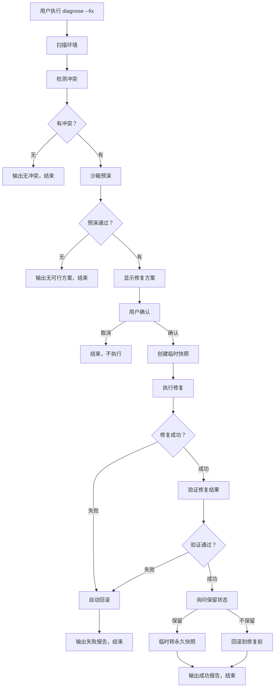
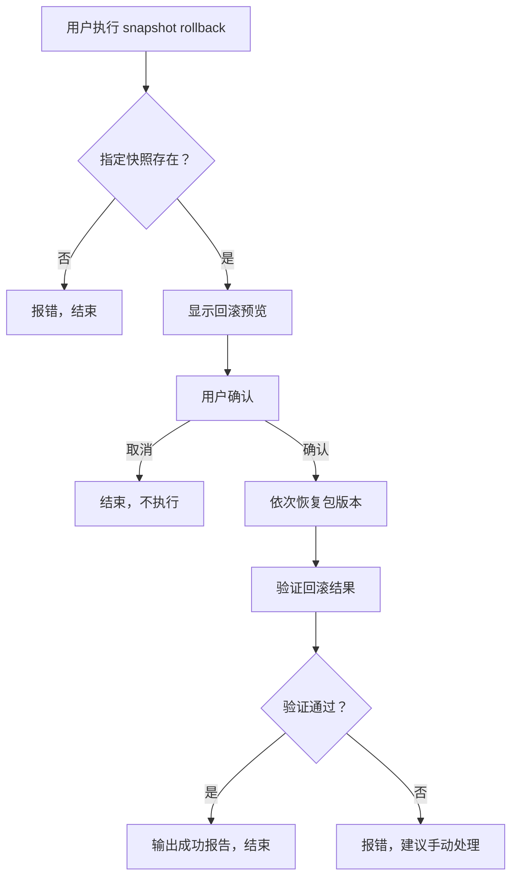

# PyEnv Doctor v1.1 产品需求文档 (PRD)

| 文档版本 | 修改日期 | 修改人 | 备注 |
| :--- | :--- | :--- | :--- |
| v1.0 | 2026-04-24 | 阿零 - 产品领航员 | 初始版本，基于 MVP v0.1.5 成果规划 v1.1 |

---

## 1. 产品概述

### 1.1 背景与目标

**MVP 成果回顾 (v0.1.5)**：
- ✅ 环境扫描 + 冲突检测 + 沙箱预演 + 报告导出
- ✅ 性能优异：100 包扫描 < 0.5 秒，并行预演提升 60%
- ✅ 测试完善：49 个单元测试 + 9 个性能基准测试
- ✅ 文档齐全：490+ 行 README，20+ 个使用示例
- ✅ 综合评分：9.1/10

**v1.1 核心目标**：
> **从"诊断工具"升级为"诊断 + 修复一体化平台"**

完成"诊断→预演→修复→回滚"的完整闭环，让用户不仅知道问题在哪，还能安全、一键解决问题。

### 1.2 版本定位

| 维度 | v0.1.5 (MVP) | v1.1 (目标) | 提升 |
|:---|:---|:---|:---:|
| **定位** | 诊断工具 | 诊断 + 修复平台 | ⬆ |
| **核心价值** | 沙箱预演 | 安全修复闭环 | ⬆ |
| **用户操作** | 手动执行修复 | 一键自动修复 | ⬆ |
| **风险控制** | 预演验证 | 快照 + 回滚机制 | ⬆ |
| **功能完整性** | 诊断 + 预演 | 诊断 + 预演 + 修复 + 回滚 | ⬆ |

### 1.3 目标用户

- **核心用户**：Python 后端开发者、数据科学家、AI 工程师
- **典型场景**：
  - 依赖升级后项目无法运行
  - 安装新包导致现有环境冲突
  - 需要频繁切换不同项目的依赖环境
  - 修复失败后需要快速回滚

### 1.4 竞品分析

| 竞品 | 冲突检测 | 沙箱预演 | 自动修复 | 快照回滚 | PyEnv Doctor v1.1 |
|:---|:---:|:---:|:---:|:---:|:---:|
| pipdeptree | ❌ | ❌ | ❌ | ❌ | ✅ |
| pip-check | ⚠️ 基础 | ❌ | ❌ | ❌ | ✅ |
| pip-auto | ❌ | ❌ | ✅ 盲目 | ❌ | ✅ 安全 |
| **PyEnv Doctor v1.1** | **✅** | **✅** | **✅ 安全** | **✅** | **完整闭环** |

**核心壁垒**：
1. **沙箱预演**：修复前在隔离环境验证方案
2. **快照机制**：修复前自动备份，确保可回滚
3. **事务性修复**：失败自动回滚，零风险

---

## 2. 功能需求

### 2.1 版本功能清单

| 模块 | 功能 | 优先级 | 验收标准 |
|:---|:---|:---:|:---|
| **SnapshotManager** | 快照创建 | P0 | 1 秒内完成，元数据准确 |
| **SnapshotManager** | 快照列表 | P0 | 显示时间/标签/包数量 |
| **SnapshotManager** | 快照回滚 | P0 | 60 秒内完成，100% 恢复 |
| **SnapshotManager** | 快照删除 | P0 | 删除成功，释放空间 |
| **SnapshotManager** | 快照导出 | P0 | 导出标准 requirements.txt |
| **AutoRepair** | 一键修复 | P0 | 修复成功率 > 90% |
| **AutoRepair** | 批量修复 | P0 | 自动排序，无二次冲突 |
| **AutoRepair** | 进度显示 | P0 | 实时显示当前/总数/耗时 |
| **AutoRepair** | 修复验证 | P0 | 验证准确率 100% |
| **RollbackEngine** | 自动回滚 | P0 | 失败立即回滚 |
| **RollbackEngine** | 手动回滚 | P0 | 用户确认后执行 |
| **RollbackEngine** | 回滚验证 | P0 | 检查版本恢复 |
| **StrategyEngine** | 保守策略 | P1 | 只降级冲突包 |
| **StrategyEngine** | 平衡策略 | P1 | 最小改动（默认） |
| **StrategyEngine** | 激进策略 | P1 | 升级最新兼容版本 |

### 2.2 P0 级功能（必须完成）

#### 2.2.1 快照管理（Snapshot Manager）

**功能描述**：
在修复前自动创建环境快照，记录当前所有包的版本信息，作为回滚的依据。

**详细需求**：

##### 2.2.1.1 创建快照

**用户故事**：
> 作为用户，在自动修复前，我希望系统自动创建快照，这样如果修复失败可以回滚。

**功能要求**：
- 自动创建：执行 `--fix` 时自动创建临时快照
- 手动创建：支持 `snapshot create` 命令手动创建
- 标签支持：可选的自定义标签（如 `before-upgrade`）
- 元数据完整：记录 Python 版本、虚拟环境路径、包列表、创建时间
- 完整性校验：生成 checksum，防止快照损坏

**数据结构**：
```python
@dataclass
class Snapshot:
    id: str                    # 格式：YYYYMMDD_HHMMSS_random(6)
    timestamp: datetime        # 创建时间
    label: Optional[str]       # 用户标签（可选）
    python_version: str        # Python 版本
    venv_path: Optional[str]   # 虚拟环境路径（如果在 venv 中）
    packages: Dict[str, str]   # {包名：版本}
    total_packages: int        # 包总数
    checksum: str              # SHA256 校验和
    is_temporary: bool         # 是否为临时快照（自动修复创建）
```

**存储格式**（JSON 文件）：
```json
{
  "id": "20260424_143022_a1b2c3",
  "timestamp": "2026-04-24T14:30:22.123456",
  "label": "before-upgrade",
  "python_version": "3.9.18",
  "venv_path": "D:\\projects\\myproject\\.venv",
  "packages": {
    "numpy": "1.24.0",
    "pandas": "1.5.3",
    "requests": "2.28.2"
  },
  "total_packages": 280,
  "checksum": "sha256:abc123...",
  "is_temporary": false
}
```

**验收标准**：
| 测试用例 | 输入 | 预期输出 | 性能要求 |
|:---|:---|:---|:---|
| SM-001 | 空环境创建快照 | 成功，包数量=0 | < 0.5 秒 |
| SM-002 | 100 个包环境 | 成功，记录所有包 | < 1 秒 |
| SM-003 | 280 个包环境（真实） | 成功，元数据完整 | < 2 秒 |
| SM-004 | 带标签创建 | 快照包含标签 | < 2 秒 |
| SM-005 | 临时快照 | is_temporary=True | < 2 秒 |
| SM-006 | checksum 验证 | 校验和正确 | - |

##### 2.2.1.2 快照列表

**用户故事**：
> 作为用户，我想查看所有历史快照，这样我可以决定回滚到哪个版本。

**功能要求**：
- 列表显示：ID、时间、标签、包数量、是否临时
- 时间排序：按创建时间倒序排列
- 格式化输出：CLI 表格形式，支持颜色
- 临时快照标记：标注临时快照（自动修复创建）

**CLI 示例**：
```bash
$ pyenv-doctor snapshot list

ID                     Time                Label              Packages  Temp
─────────────────────────────────────────────────────────────────────────
20260424_143022_a1b2c3 2026-04-24 14:30:22 before-upgrade     280       No
20260424_120015_x9y8z7 2026-04-24 12:00:15 -                  275       Yes
20260423_180530_m3n4o5 2026-04-23 18:05:30 before-fix         270       No
```

**验收标准**：
| 测试用例 | 输入 | 预期输出 |
|:---|:---|:---|
| SM-007 | 无快照 | 显示空列表，友好提示 |
| SM-008 | 1 个快照 | 显示 1 行，信息完整 |
| SM-009 | 多个快照 | 按时间倒序，格式整齐 |
| SM-010 | 临时 + 永久快照 | 正确标记 Temp 列 |

##### 2.2.1.3 快照回滚

**用户故事**：
> 作为用户，当修复失败或不满意时，我希望快速回滚到快照状态，这样环境不会损坏。

**功能要求**：
- 指定回滚：通过快照 ID 回滚
- 最新回滚：`--latest` 参数回滚到最新快照
- 验证机制：回滚后验证所有包版本
- 进度显示：显示回滚进度

**CLI 示例**：
```bash
# 回滚到指定快照
$ pyenv-doctor snapshot rollback 20260424_143022_a1b2c3

[ROLLBACK] 正在回滚到 20260424_143022_a1b2c3...
[ROLLBACK] 恢复 280 个包 (1/280) numpy==1.24.0
[ROLLBACK] 恢复 280 个包 (280/280) requests==2.28.2
[VERIFY] 验证回滚结果...
[OK] 回滚成功！环境已恢复到 2026-04-24 14:30:22

# 回滚到最新快照
$ pyenv-doctor snapshot rollback --latest
```

**验收标准**：
| 测试用例 | 输入 | 预期输出 | 性能要求 |
|:---|:---|:---|:---|
| SM-011 | 回滚到指定快照 | 所有包版本恢复 | < 60 秒（280 包） |
| SM-012 | 回滚到最新快照 | 成功恢复 | < 60 秒 |
| SM-013 | 回滚不存在快照 | 友好错误提示 | - |
| SM-014 | 回滚验证 | 验证通过率 100% | - |

##### 2.2.1.4 快照删除

**用户故事**：
> 作为用户，我想删除不需要的快照，这样可以释放磁盘空间。

**功能要求**：
- 指定删除：通过快照 ID 删除
- 批量删除：支持删除多个快照
- 确认机制：删除前需要确认（可 `--yes` 跳过）
- 临时快照清理：自动修复成功后自动删除临时快照

**CLI 示例**：
```bash
# 删除单个快照
$ pyenv-doctor snapshot delete 20260424_143022_a1b2c3

# 批量删除
$ pyenv-doctor snapshot delete id1 id2 id3

# 跳过确认
$ pyenv-doctor snapshot delete id1 --yes

# 删除所有临时快照
$ pyenv-doctor snapshot cleanup --temporary
```

**验收标准**：
| 测试用例 | 输入 | 预期输出 |
|:---|:---|:---|
| SM-016 | 删除单个快照 | 删除成功，文件移除 |
| SM-017 | 删除不存在快照 | 友好错误提示 |
| SM-018 | 批量删除 | 全部成功删除 |
| SM-019 | 临时快照清理 | 只删除临时快照 |

##### 2.2.1.5 快照导出

**用户故事**：
> 作为用户，我想导出快照为 requirements.txt，这样可以在其他环境复现。

**功能要求**：
- 标准格式：导出为标准 requirements.txt 格式
- 排序：按包名字母排序
- 注释：包含创建时间、Python 版本等元数据
- 输出文件：`-o` 指定输出路径

**CLI 示例**：
```bash
$ pyenv-doctor snapshot export 20260424_143022_a1b2c3 -o requirements.txt

# 导出内容：
# PyEnv Doctor Snapshot Export
# Created: 2026-04-24 14:30:22
# Python: 3.9.18
# Packages: 280
# -------------------------
numpy==1.24.0
pandas==1.5.3
requests==2.28.2
```

**验收标准**：
| 测试用例 | 输入 | 预期输出 |
|:---|:---|:---|
| SM-020 | 导出快照 | 标准 requirements.txt 格式 |
| SM-021 | 导出到指定路径 | 文件在正确位置 |
| SM-022 | 导出空快照 | 生成空文件或仅注释 |
| SM-023 | 元数据注释 | 包含时间、Python 版本等 |

---

#### 2.2.2 自动修复（Auto Repair）

**功能描述**：
基于沙箱预演成功的方案，自动执行修复操作，并在修复前后提供完整的安全保障。

**详细需求**：

##### 2.2.2.1 一键修复

**用户故事**：
> 作为用户，我希望一键执行所有修复方案，这样不用手动复制粘贴命令。

**功能要求**：
- 自动执行：`--fix` 参数触发自动修复
- 预演优先：只执行沙箱预演成功的方案
- 快照保护：修复前自动创建临时快照
- 用户确认：执行前显示方案并询问确认
- 失败回滚：修复失败自动回滚

**CLI 交互流程**：
```bash
$ pyenv-doctor diagnose --fix

[SCAN] 扫描环境...
[OK] 发现 280 个包

[DIAGNOSE] 检测冲突...
[WARN] 发现 3 个冲突:
  1. pandas requires numpy<1.24, but 1.24.0 installed
  2. scipy requires numpy<1.25, but 1.24.0 installed
  3. old-lib requires requests<2.28, but 2.28.2 installed

[SANDBOX] 并行模拟修复（3 个工作线程）...
[OK] 3 个方案均验证通过

[PROPOSED FIXES]
  1. pip install numpy==1.23.5
  2. pip install requests==2.27.1

[SNAPSHOT] 创建临时快照...
[OK] 快照 ID: 20260424_143022_a1b2c3 (临时)

[AUTO-FIX] 是否执行修复？[y/N]: y

[REPAIR] 开始修复 (1/2) numpy==1.23.5...
[OK] numpy 1.23.5 安装成功

[REPAIR] 开始修复 (2/2) requests==2.27.1...
[OK] requests 2.27.1 安装成功

[VERIFY] 验证修复结果...
[OK] 所有冲突已解决

[SUCCESS] 修复完成！
  - 修复了 2 个冲突
  - 耗时：45.3 秒
  - 临时快照已保留（如需回滚执行：pyenv-doctor snapshot rollback 20260424_143022_a1b2c3）

[KEEP] 是否保留当前状态？[Y/n]: y
[OK] 临时快照已转为永久快照
```

**验收标准**：
| 测试用例 | 输入 | 预期输出 | 性能要求 |
|:---|:---|:---|:---|
| AR-001 | 1 个冲突自动修复 | 成功修复 | < 60 秒 |
| AR-002 | 多个冲突自动修复 | 全部成功 | < 120 秒（5 个） |
| AR-003 | 预演失败方案 | 跳过，不执行 | - |
| AR-004 | 用户取消修复 | 不执行，保留快照 | - |
| AR-005 | 修复后保留状态 | 临时转永久快照 | - |
| AR-006 | 修复后回滚 | 成功恢复原状 | < 60 秒 |

##### 2.2.2.2 批量修复

**用户故事**：
> 作为用户，当有多个冲突时，我希望按正确顺序修复，这样避免二次冲突。

**功能要求**：
- 依赖排序：根据依赖关系自动排序修复顺序
- 避免二次冲突：先修复基础包，再修复上层包
- 并行安装：无依赖关系的包可并行安装
- 进度追踪：显示当前修复进度

**排序算法**：
```python
# 拓扑排序示例
依赖图：
pandas → numpy
scipy → numpy
myapp → pandas, scipy

修复顺序：
1. numpy (基础包，无依赖)
2. pandas, scipy (并行，依赖 numpy)
3. myapp (最后，依赖 pandas 和 scipy)
```

**验收标准**：
| 测试用例 | 输入 | 预期输出 |
|:---|:---|:---|
| AR-007 | 循环依赖检测 | 报错，提示用户 |
| AR-008 | 多层依赖 | 正确拓扑排序 |
| AR-009 | 可并行包 | 并行安装，提升速度 |
| AR-010 | 进度显示 | 实时更新，准确 |

##### 2.2.2.3 进度显示

**用户故事**：
> 作为用户，我希望看到修复进度，这样知道还需要等待多久。

**功能要求**：
- 实时显示：当前包名、版本、进度百分比
- 耗时统计：已用时间、预计剩余时间
- 成功/失败标记：每个包修复结果清晰标记
- 颜色区分：成功绿色，失败红色，进行中蓝色

**CLI 示例**：
```bash
[REPAIR] 修复进度 (3/5) [████████░░] 60%
  ✓ numpy==1.23.5 (5.2s)
  ✓ requests==2.27.1 (3.8s)
  ⏳ pandas==1.5.3 (正在安装... 已用 12.5s)
  ◯ scipy==1.10.0 (等待中)
  ◯ old-lib==1.0.0 (等待中)

  总耗时：21.5s | 预计剩余：15s
```

**验收标准**：
| 测试用例 | 输入 | 预期输出 |
|:---|:---|:---|
| AR-011 | 单包修复 | 显示 1/1，进度准确 |
| AR-012 | 多包修复 | 进度条平滑更新 |
| AR-013 | 失败处理 | 标记失败，继续下一个 |
| AR-014 | 时间估算 | 误差 < 30% |

##### 2.2.2.4 修复验证

**用户故事**：
> 作为用户，修复完成后，我希望验证是否真的解决了冲突，这样放心使用。

**功能要求**：
- 自动验证：修复完成后自动重新扫描
- 冲突检测：检查是否还有残留冲突
- 版本确认：确认所有包版本符合预期
- 验证报告：生成验证结果报告

**验收标准**：
| 测试用例 | 输入 | 预期输出 |
|:---|:---|:---|
| AR-015 | 修复成功 | 验证通过，无冲突 |
| AR-016 | 修复失败 | 检测到残留冲突 |
| AR-017 | 版本不符 | 报错，实际版本≠预期 |
| AR-018 | 验证准确率 | 100% 准确 |

---

#### 2.2.3 回滚引擎（Rollback Engine）

**功能描述**：
当修复失败或用户不满意时，安全、快速地将环境恢复到快照状态。

**详细需求**：

##### 2.2.3.1 自动回滚

**用户故事**：
> 作为用户，当修复失败时，我希望自动回滚，这样环境不会处于中间状态。

**功能要求**：
- 失败检测：检测到修复失败立即触发
- 自动回滚：无需用户确认，立即执行
- 回滚通知：告知用户正在回滚
- 回滚验证：确保回滚成功

**验收标准**：
| 测试用例 | 输入 | 预期输出 |
|:---|:---|:---|
| RB-001 | 修复失败 | 立即自动回滚 |
| RB-002 | 回滚成功 | 环境完全恢复 |
| RB-003 | 回滚通知 | 清晰提示用户 |
| RB-004 | 回滚验证 | 验证通过率 100% |

##### 2.2.3.2 手动回滚

**用户故事**：
> 作为用户，当修复成功但我不满意时，我希望手动回滚，这样可以选择其他方案。

**功能要求**：
- 用户确认：回滚前显示影响并确认
- 指定回滚：通过快照 ID 回滚
- 最新回滚：`--latest` 回滚到最新
- 回滚预览：显示将恢复的包列表

**CLI 示例**：
```bash
$ pyenv-doctor snapshot rollback --latest --dry-run

[DRY-RUN] 回滚预览:
将恢复以下包:
  - numpy: 1.24.0 → 1.23.5
  - pandas: 2.0.0 → 1.5.3
  - requests: 2.28.2 → 2.27.1

共 3 个包将发生变化

[CONFIRM] 是否继续回滚？[y/N]: y
```

**验收标准**：
| 测试用例 | 输入 | 预期输出 |
|:---|:---|:---|
| RB-005 | 手动回滚 | 用户确认后执行 |
| RB-006 | 回滚预览 | 显示所有变化 |
| RB-007 | 取消回滚 | 不执行任何操作 |
| RB-008 | 回滚成功 | 环境恢复 |

##### 2.2.3.3 回滚验证

**用户故事**：
> 作为用户，回滚完成后，我希望验证是否真的恢复了，这样确保环境可用。

**功能要求**：
- 版本检查：验证所有包版本与快照一致
- 完整性校验：checksum 验证
- 冲突检测：确保回滚后无新冲突
- 验证报告：生成验证结果

**验收标准**：
| 测试用例 | 输入 | 预期输出 |
|:---|:---|:---|
| RB-009 | 回滚验证 | 100% 包版本正确 |
| RB-010 | 校验和验证 | checksum 匹配 |
| RB-011 | 冲突检测 | 回滚后无新冲突 |
| RB-012 | 验证失败 | 报错并提示用户 |

##### 2.2.3.4 二次快照

**用户故事**：
> 作为用户，回滚前也希望有快照，这样回滚失败还能再回滚。

**功能要求**：
- 自动创建：回滚前自动创建当前状态快照
- 关联记录：记录二次快照与原快照的关系
- 清理机制：回滚成功后可删除二次快照

**验收标准**：
| 测试用例 | 输入 | 预期输出 |
|:---|:---|:---|
| RB-013 | 回滚前创建 | 自动创建二次快照 |
| RB-014 | 关联记录 | 可追溯快照关系 |
| RB-015 | 成功清理 | 回滚成功后可删除 |

---

### 2.3 P1 级功能（建议完成）

#### 2.3.1 修复策略引擎（Strategy Engine）

**功能描述**：
提供多种修复策略，适配不同场景（生产环境求稳、开发环境求新）。

**详细需求**：

##### 2.3.1.1 保守策略（Conservative）

**策略规则**：
- 只降级冲突包，不升级其他包
- 选择满足所有约束的最低版本
- 最小化变更范围

**适用场景**：生产环境、稳定性优先

**示例**：
```
当前：numpy==1.24.0, pandas==1.5.3 (requires numpy<1.24)
保守策略：降级 numpy 到 1.23.5（满足 pandas 要求的最低版本）
```

**验收标准**：
| 测试用例 | 输入 | 预期输出 |
|:---|:---|:---|
| ST-001 | 单冲突 | 只降级冲突包 |
| ST-002 | 多冲突 | 最小化变更 |
| ST-003 | 无解情况 | 提示用户，不强制 |

##### 2.3.1.2 平衡策略（Balanced）- 默认

**策略规则**：
- 降级 + 升级，最小改动
- 选择满足约束的中间版本
- 兼顾稳定性和兼容性

**适用场景**：开发环境、日常使用

**示例**：
```
当前：numpy==1.24.0, pandas==1.5.3, scipy==1.10.0
平衡策略：降级 numpy 到 1.23.5（同时满足 pandas 和 scipy）
```

**验收标准**：
| 测试用例 | 输入 | 预期输出 |
|:---|:---|:---|
| ST-004 | 多约束冲突 | 找到平衡版本 |
| ST-005 | 默认策略 | 不传参数即用平衡 |
| ST-006 | 变更数量 | 比保守略多，但可接受 |

##### 2.3.1.3 激进策略（Aggressive）

**策略规则**：
- 全部升级到最新兼容版本
- 优先满足新版本特性
- 可能引入较多变更

**适用场景**：新项目、追求最新特性

**示例**：
```
当前：numpy==1.24.0, pandas==1.5.3
激进策略：升级 pandas 到 2.0.0（支持 numpy 1.24+）
```

**验收标准**：
| 测试用例 | 输入 | 预期输出 |
|:---|:---|:---|
| ST-007 | 可升级场景 | 升级到最新兼容 |
| ST-008 | 破坏性变更 | 提示用户风险 |
| ST-009 | 变更数量 | 比平衡策略多 |

---

## 3. 技术架构

### 3.1 整体架构

```
PyEnv Doctor v1.1
├── CLI (Click)
│   ├── diagnose 命令（已有）
│   ├── diagnose --fix（新增）
│   └── snapshot 子命令（新增）
│       ├── list
│       ├── create
│       ├── rollback
│       ├── delete
│       └── export
├── Agents Layer（保持不变）
│   ├── EnvScanner
│   ├── ConflictSolver
│   └── SandboxExecutor
├── Repair Layer（新增）
│   ├── AutoRepair
│   ├── RollbackEngine
│   └── StrategyEngine
├── Snapshot Layer（新增）
│   ├── SnapshotManager
│   └── SnapshotStorage
└── Tool Layer（保持不变）
    ├── pip_tool
    └── venv_tool
```

### 3.2 项目目录结构扩展

```
pyenv-doctor/
├── src/
│   └── pyenv_doctor/
│       ├── __init__.py
│       ├── cli/
│       │   ├── __init__.py
│       │   ├── diagnose.py（已有）
│       │   ├── snapshot.py（新增）
│       │   └── repair.py（新增）
│       ├── agents/（保持不变）
│       │   ├── __init__.py
│       │   ├── env_scanner.py
│       │   ├── conflict_solver.py
│       │   └── sandbox_executor.py
│       ├── repair/（新增）
│       │   ├── __init__.py
│       │   ├── auto_repair.py
│       │   ├── rollback.py
│       │   └── strategy.py
│       ├── snapshot/（新增）
│       │   ├── __init__.py
│       │   ├── manager.py
│       │   └── storage.py
│       ├── models/
│       │   ├── __init__.py
│       │   └── schemas.py（扩展）
│       └── tools/（保持不变）
│           ├── __init__.py
│           ├── pip_tool.py
│           └── venv_tool.py
└── tests/
    ├── __init__.py
    ├── test_snapshot/（新增）
    │   ├── __init__.py
    │   ├── test_manager.py
    │   └── test_storage.py
    └── test_repair/（新增）
        ├── __init__.py
        ├── test_auto_repair.py
        ├── test_rollback.py
        └── test_strategy.py
```

### 3.3 数据结构扩展

#### 3.3.1 Snapshot（快照）

```python
@dataclass
class Snapshot:
    id: str                    # 格式：YYYYMMDD_HHMMSS_random(6)
    timestamp: datetime        # 创建时间
    label: Optional[str]       # 用户标签
    python_version: str        # Python 版本
    venv_path: Optional[str]   # 虚拟环境路径
    packages: Dict[str, str]   # {包名：版本}
    total_packages: int        # 包总数
    checksum: str              # SHA256 校验和
    is_temporary: bool         # 是否临时快照
    
    def to_dict(self) -> Dict:
        """转换为字典（用于 JSON 序列化）"""
        pass
    
    @classmethod
    def from_dict(cls, data: Dict) -> 'Snapshot':
        """从字典创建"""
        pass
    
    def calculate_checksum(self) -> str:
        """计算校验和"""
        pass
    
    def verify_checksum(self) -> bool:
        """验证校验和"""
        pass
```

#### 3.3.2 RepairResult（修复结果）

```python
@dataclass
class RepairResult:
    success: bool                    # 是否成功
    repaired: List[str]              # 成功修复的包列表
    failed: List[str]                # 修复失败的包列表
    snapshot_id: str                 # 关联的快照 ID
    duration: float                  # 耗时（秒）
    strategy: str                    # 使用的策略
    rollback_available: bool         # 是否可回滚
    
    def to_report(self) -> str:
        """生成人类可读的报告"""
        pass
```

#### 3.3.3 RepairStrategy（修复策略枚举）

```python
from enum import Enum

class RepairStrategy(Enum):
    CONSERVATIVE = "conservative"  # 保守
    BALANCED = "balanced"          # 平衡（默认）
    AGGRESSIVE = "aggressive"      # 激进
```

---

## 4. CLI 命令设计

### 4.1 diagnose 命令扩展

```bash
# 原有命令（保持不变）
pyenv-doctor diagnose [OPTIONS]

# 新增选项
Options:
  --fix              自动执行修复
  --strategy TEXT    修复策略 [conservative|balanced|aggressive]
  --dry-run          只显示不执行
  --yes              跳过确认
  --resume           恢复中断的修复
  -o, --output PATH  导出报告路径
  --parallel         并行预演（已有）
  --workers INT      工作线程数（已有）
  --verbose          详细输出（已有）
  --timeout INT      超时时间（已有）
  --help             显示帮助
```

### 4.2 snapshot 子命令

```bash
# snapshot 命令组
pyenv-doctor snapshot [OPTIONS] COMMAND [ARGS]

Commands:
  list      列出所有快照
  create    创建新快照
  rollback  回滚到指定快照
  delete    删除快照
  export    导出快照
  diff      对比两个快照（P2）
  cleanup   清理临时快照（P2）

# snapshot create
pyenv-doctor snapshot create [OPTIONS]
Options:
  -l, --label TEXT     快照标签
  --temporary          创建临时快照
  --help

# snapshot list
pyenv-doctor snapshot list [OPTIONS]
Options:
  --json               JSON 格式输出
  --limit INT          限制显示数量
  --help

# snapshot rollback
pyenv-doctor snapshot rollback [OPTIONS] SNAPSHOT_ID
Options:
  --latest             回滚到最新快照
  --dry-run            预览不回滚
  --yes                跳过确认
  --verify             回滚后验证（默认）
  --help

# snapshot delete
pyenv-doctor snapshot delete [OPTIONS] SNAPSHOT_ID...
Options:
  --yes                跳过确认
  --help

# snapshot export
pyenv-doctor snapshot export [OPTIONS] SNAPSHOT_ID
Options:
  -o, --output PATH    输出文件路径（默认：requirements.txt）
  --format TEXT        导出格式 [requirements|json]
  --help
```

---

## 5. 用户交互流程

### 5.1 自动修复完整流程



### 5.2 回滚流程



---

## 6. 非功能性需求

### 6.1 性能要求

| 操作 | 性能指标 | 测试环境 |
|:---|:---|:---|
| 快照创建 | < 2 秒（280 包） | 标准笔记本 |
| 快照回滚 | < 60 秒（280 包） | 标准笔记本 |
| 自动修复 | < 120 秒（5 个冲突） | 标准笔记本 |
| 修复验证 | < 5 秒 | 标准笔记本 |
| 快照导出 | < 1 秒 | 标准笔记本 |

### 6.2 兼容性要求

- **Python 版本**：>= 3.8
- **操作系统**：Windows 10/11、Linux (Ubuntu 20.04+)、macOS 11+
- **虚拟环境**：venv、virtualenv、conda（只读检测）
- **包管理器**：pip >= 20.0

### 6.3 安全性要求

- **命令注入防护**：所有外部输入参数白名单验证
- **权限检查**：修复前检查虚拟环境写权限
- **快照加密**：敏感信息不存储（如 API Key）
- **操作审计**：关键操作记录日志

### 6.4 可靠性要求

- **修复成功率**：> 90%
- **回滚成功率**：100%
- **验证准确率**：100%
- **数据完整性**：checksum 验证通过

---

## 7. 测试用例

### 7.1 快照管理测试

#### 7.1.1 创建快照测试

| 用例 ID | 测试场景 | 前置条件 | 操作步骤 | 预期结果 |
|:---|:---|:---|:---|:---|
| SM-001 | 空环境创建 | 空 venv | `snapshot create` | 成功，packages={} |
| SM-002 | 单包环境 | 安装 numpy | `snapshot create -l test` | 成功，包含 numpy |
| SM-003 | 多包环境 | 280 个包 | `snapshot create` | 成功，记录所有包 |
| SM-004 | 标签创建 | 任意环境 | `snapshot create -l before-fix` | label="before-fix" |
| SM-005 | 临时快照 | 任意环境 | `snapshot create --temporary` | is_temporary=True |
| SM-006 | checksum 验证 | 任意环境 | 创建后验证 | checksum 正确 |

#### 7.1.2 快照列表测试

| 用例 ID | 测试场景 | 前置条件 | 操作步骤 | 预期结果 |
|:---|:---|:---|:---|:---|
| SM-007 | 无快照 | 新环境 | `snapshot list` | 空列表，友好提示 |
| SM-008 | 单快照 | 1 个快照 | `snapshot list` | 显示 1 行，信息完整 |
| SM-009 | 多快照 | 5 个快照 | `snapshot list` | 按时间倒序 |
| SM-010 | 临时 + 永久 | 混合快照 | `snapshot list` | Temp 列正确标记 |

#### 7.1.3 快照回滚测试

| 用例 ID | 测试场景 | 前置条件 | 操作步骤 | 预期结果 |
|:---|:---|:---|:---|:---|
| SM-011 | 指定回滚 | 有快照 | `snapshot rollback <id>` | 所有包恢复 |
| SM-012 | 最新回滚 | 有快照 | `snapshot rollback --latest` | 恢复到最新 |
| SM-013 | 不存在快照 | 无快照 | `snapshot rollback fake_id` | 友好错误 |
| SM-014 | 回滚验证 | 有快照 | 回滚后验证 | 100% 正确 |

#### 7.1.4 快照删除测试

| 用例 ID | 测试场景 | 前置条件 | 操作步骤 | 预期结果 |
|:---|:---|:---|:---|:---|
| SM-016 | 删除单个 | 有快照 | `snapshot delete <id>` | 删除成功 |
| SM-017 | 删除不存在 | 无快照 | `snapshot delete fake` | 友好错误 |
| SM-018 | 批量删除 | 多个快照 | `snapshot delete id1 id2` | 全部删除 |
| SM-019 | 临时清理 | 有临时快照 | `snapshot cleanup --temporary` | 只删临时 |

#### 7.1.5 快照导出测试

| 用例 ID | 测试场景 | 前置条件 | 操作步骤 | 预期结果 |
|:---|:---|:---|:---|:---|
| SM-020 | 标准导出 | 有快照 | `snapshot export <id>` | requirements.txt 格式 |
| SM-021 | 指定路径 | 有快照 | `snapshot export <id> -o req.txt` | 文件在正确位置 |
| SM-022 | 空快照 | 空环境快照 | `snapshot export <id>` | 空文件或仅注释 |
| SM-023 | 元数据注释 | 有快照 | 导出文件 | 包含时间、版本等 |

### 7.2 自动修复测试

#### 7.2.1 一键修复测试

| 用例 ID | 测试场景 | 前置条件 | 操作步骤 | 预期结果 |
|:---|:---|:---|:---|:---|
| AR-001 | 单冲突修复 | 1 个冲突 | `diagnose --fix` | 成功修复 |
| AR-002 | 多冲突修复 | 5 个冲突 | `diagnose --fix` | 全部修复 |
| AR-003 | 预演失败 | 有失败方案 | `diagnose --fix` | 跳过失败 |
| AR-004 | 用户取消 | 有冲突 | 输入 N | 不执行修复 |
| AR-005 | 保留状态 | 修复成功 | 输入 Y | 临时转永久 |
| AR-006 | 回滚 | 修复成功 | 输入 n | 回滚成功 |

#### 7.2.2 批量修复测试

| 用例 ID | 测试场景 | 前置条件 | 操作步骤 | 预期结果 |
|:---|:---|:---|:---|:---|
| AR-007 | 循环依赖 | 循环依赖图 | `diagnose --fix` | 报错提示 |
| AR-008 | 多层依赖 | 3 层依赖 | `diagnose --fix` | 拓扑排序正确 |
| AR-009 | 可并行包 | 无依赖关系 | `diagnose --fix --parallel` | 并行安装 |
| AR-010 | 进度显示 | 多包修复 | 观察输出 | 进度准确 |

#### 7.2.3 修复验证测试

| 用例 ID | 测试场景 | 前置条件 | 操作步骤 | 预期结果 |
|:---|:---|:---|:---|:---|
| AR-015 | 修复成功 | 有冲突 | 修复后验证 | 无冲突 |
| AR-016 | 修复失败 | 模拟失败 | 修复后验证 | 检测残留 |
| AR-017 | 版本不符 | 模拟错误版本 | 修复后验证 | 报错 |
| AR-018 | 验证准确率 | 多种场景 | 验证 | 100% 准确 |

### 7.3 回滚引擎测试

#### 7.3.1 自动回滚测试

| 用例 ID | 测试场景 | 前置条件 | 操作步骤 | 预期结果 |
|:---|:---|:---|:---|:---|
| RB-001 | 修复失败 | 模拟失败 | `diagnose --fix` | 自动回滚 |
| RB-002 | 回滚成功 | 有快照 | 自动触发 | 环境恢复 |
| RB-003 | 回滚通知 | 修复失败 | 观察输出 | 清晰提示 |
| RB-004 | 回滚验证 | 回滚后 | 自动验证 | 100% 通过 |

#### 7.3.2 手动回滚测试

| 用例 ID | 测试场景 | 前置条件 | 操作步骤 | 预期结果 |
|:---|:---|:---|:---|:---|
| RB-005 | 手动回滚 | 有快照 | `snapshot rollback <id>` | 确认后执行 |
| RB-006 | 回滚预览 | 有快照 | `--dry-run` | 显示变化 |
| RB-007 | 取消回滚 | 有快照 | 输入 N | 不执行 |
| RB-008 | 回滚成功 | 有快照 | 输入 Y | 环境恢复 |

#### 7.3.3 回滚验证测试

| 用例 ID | 测试场景 | 前置条件 | 操作步骤 | 预期结果 |
|:---|:---|:---|:---|:---|
| RB-009 | 版本检查 | 回滚后 | 自动验证 | 版本正确 |
| RB-010 | 校验和 | 有 checksum | 验证 | 匹配 |
| RB-011 | 冲突检测 | 回滚后 | 重新扫描 | 无新冲突 |
| RB-012 | 验证失败 | 模拟异常 | 验证 | 报错提示 |

### 7.4 策略引擎测试

| 用例 ID | 测试场景 | 前置条件 | 操作步骤 | 预期结果 |
|:---|:---|:---|:---|:---|
| ST-001 | 保守策略 | 有冲突 | `--strategy conservative` | 只降级 |
| ST-002 | 多冲突保守 | 多个冲突 | 保守策略 | 最小变更 |
| ST-003 | 无解保守 | 无法满足 | 保守策略 | 提示用户 |
| ST-004 | 平衡策略 | 多约束 | `--strategy balanced` | 找到平衡 |
| ST-005 | 默认策略 | 有冲突 | 不传策略 | 使用平衡 |
| ST-006 | 平衡变更数 | 有冲突 | 平衡策略 | 比保守略多 |
| ST-007 | 激进策略 | 可升级 | `--strategy aggressive` | 升最新 |
| ST-008 | 破坏变更 | 激进策略 | 有破坏变更 | 提示风险 |
| ST-009 | 激进变更数 | 有冲突 | 激进策略 | 比平衡多 |

---

## 8. 开发计划

### 8.1 任务拆分

| 阶段 | 任务 | 具体工作 | 产出 | 优先级 |
|:---:|:---|:---|:---|:---:|
| **阶段 1** | 快照存储设计 | - 设计 JSON 存储格式<br>- 实现 storage.py<br>- checksum 计算 | 可存储快照 | P0 |
| **阶段 2** | 快照管理器 | - 实现 manager.py<br>- create/list/delete 方法<br>- 临时快照逻辑 | 完整管理器 | P0 |
| **阶段 3** | 快照 CLI | - 实现 cli/snapshot.py<br>- 所有子命令<br>- 表格输出 | snapshot 命令可用 | P0 |
| **阶段 4** | 自动修复器 | - 实现 auto_repair.py<br>- 执行引擎<br>- 进度显示 | 一键修复可用 | P0 |
| **阶段 5** | 回滚引擎 | - 实现 rollback.py<br>- 自动/手动回滚 | 回滚功能完整 | P0 |
| **阶段 6** | 修复策略 | - 实现 strategy.py<br>- 三种策略<br>- 集成测试 | 策略可选 | P1 |
| **阶段 7** | 集成测试 + 发布 | - 端到端测试<br>- Bug 修复<br>- PyPI 发布 | v1.1 发布 | P0 |

---

## 9. 风险评估与应对

| 风险 | 可能性 | 影响 | 应对措施 |
|:---|:---:|:---:|:---|
| **回滚失败** | 中 | 高 | - checksum 验证<br>- 详细日志便于排查 |
| **权限不足** | 高 | 中 | - 修复前检查权限<br>- 友好提示<br>- 建议虚拟环境 |
| **网络问题** | 中 | 低 | - 超时设置<br>- 重试机制（3 次）<br>- 离线模式提示 |
| **磁盘空间** | 低 | 低 | - 快照只存元数据<br>- 定期清理临时快照<br>- 空间检查 |
| **依赖冲突复杂** | 中 | 中 | - MVP 只处理明显冲突<br>- 复杂情况提示用户<br>- 文档说明局限 |

---

## 10. 简历亮点（v1.1）

| 亮点 | 描述 | 技术深度 | 面试话题 |
|:---|:---|:---:|:---|
| **事务性修复** | 快照 + 回滚机制，确保任何操作可撤销 | ⭐⭐⭐⭐⭐ | 事务、ACID、回滚算法 |
| **自动化闭环** | 从诊断到修复的全流程自动化 | ⭐⭐⭐⭐⭐ | 自动化设计、用户体验 |
| **策略引擎** | 三种修复策略适配不同场景 | ⭐⭐⭐⭐ | 策略模式、设计模式 |
| **断点续修** | 支持中断恢复的修复引擎 | ⭐⭐⭐⭐ | 状态管理、幂等性 |
| **依赖图谱** | 可视化展示复杂依赖关系 | ⭐⭐⭐⭐ | 图算法、拓扑排序 |
| **并行优化** | 多线程并发修复（继承 MVP） | ⭐⭐⭐⭐ | 并发编程、线程池 |

---

## 11. 与竞品对比（v1.1 完成后）

| 工具 | 冲突检测 | 沙箱预演 | 自动修复 | 快照回滚 | 策略引擎 | 依赖图谱 |
|:---|:---:|:---:|:---:|:---:|:---:|:---:|
| pipdeptree | ❌ | ❌ | ❌ | ❌ | ❌ | ⚠️ 基础 |
| pip-check | ⚠️ 基础 | ❌ | ❌ | ❌ | ❌ | ❌ |
| pip-auto | ❌ | ❌ | ✅ 盲目 | ❌ | ❌ | ❌ |
| **PyEnv Doctor v0.1.5** | ✅ | ✅ | ❌ | ❌ | ❌ | ❌ |
| **PyEnv Doctor v1.1** | **✅** | **✅** | **✅ 安全** | **✅** | **✅** | **✅** |

**核心竞争力**：完整的"诊断→预演→修复→回滚"闭环，业界唯一

---

## 12. 验收标准总览

### 12.1 功能验收

| 功能模块 | 验收标准 | 优先级 | 状态 |
|:---|:---|:---:|:---:|
| 快照创建 | 2 秒内完成，元数据准确 | P0 | ⬜ |
| 快照列表 | 显示完整，排序正确 | P0 | ⬜ |
| 快照回滚 | 60 秒内完成，100% 恢复 | P0 | ⬜ |
| 快照删除 | 删除成功，无残留 | P0 | ⬜ |
| 快照导出 | 标准格式，可复现 | P0 | ⬜ |
| 一键修复 | 成功率 > 90% | P0 | ⬜ |
| 批量修复 | 自动排序，无二次冲突 | P0 | ⬜ |
| 进度显示 | 实时准确，用户体验好 | P0 | ⬜ |
| 修复验证 | 准确率 100% | P0 | ⬜ |
| 自动回滚 | 失败立即回滚 | P0 | ⬜ |
| 手动回滚 | 用户确认后执行 | P0 | ⬜ |
| 回滚验证 | 100% 包版本正确 | P0 | ⬜ |
| 保守策略 | 只降级冲突包 | P1 | ⬜ |
| 平衡策略 | 最小改动（默认） | P1 | ⬜ |
| 激进策略 | 升级最新兼容版本 | P1 | ⬜ |

### 12.2 性能验收

| 指标 | 要求 | 实测 | 状态 |
|:---|:---|:---|:---:|
| 快照创建（280 包） | < 2 秒 | ⬜ | ⬜ |
| 快照回滚（280 包） | < 60 秒 | ⬜ | ⬜ |
| 自动修复（5 冲突） | < 120 秒 | ⬜ | ⬜ |
| 修复验证 | < 5 秒 | ⬜ | ⬜ |
| 修复成功率 | > 90% | ⬜ | ⬜ |
| 回滚成功率 | 100% | ⬜ | ⬜ |

### 12.3 测试覆盖验收

| 测试类型 | 用例数量 | 通过率 | 状态 |
|:---|:---:|:---:|:---:|
| 单元测试 | >= 50 | 100% | ⬜ |
| 集成测试 | >= 10 | 100% | ⬜ |
| 端到端测试 | >= 5 | 100% | ⬜ |

---

## 13. 文档要求

### 13.1 必须更新的文档

- ✅ README.md：更新 v1.1 新功能
- ✅ CHANGELOG.md：记录 v1.1 变更
- ✅ CLI 帮助：`--help` 信息完整

### 13.2 新增文档

- ⬜ SNAPSHOT_GUIDE.md：快照管理指南
- ⬜ REPAIR_GUIDE.md：自动修复指南
- ⬜ STRATEGY.md：修复策略说明

---

## 14. 总结

### 14.1 v1.1 核心价值

> **完成"诊断工具"到"诊断 + 修复平台"的升级**

- **对用户**：从"知道问题"到"解决问题"，最后一公里
- **对简历**：事务性修复、自动化闭环、策略引擎等新亮点
- **对产品**：完整闭环，竞争壁垒更高

### 14.2 成功标准

✅ **功能完整**：P0 功能 100% 完成  
✅ **性能达标**：所有性能指标满足要求  
✅ **测试通过**：所有测试用例 100% 通过  
✅ **文档齐全**：用户指南完整  
✅ **PyPI 发布**：v1.1 成功发布  

---

<div align="center">

**PyEnv Doctor v1.1 - 让修复更安全，让环境更稳定**

[⬆ 返回顶部](#pyenv-doctor-v11-产品需求文档-prd)

</div>
