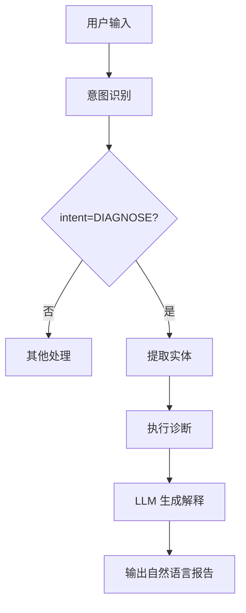
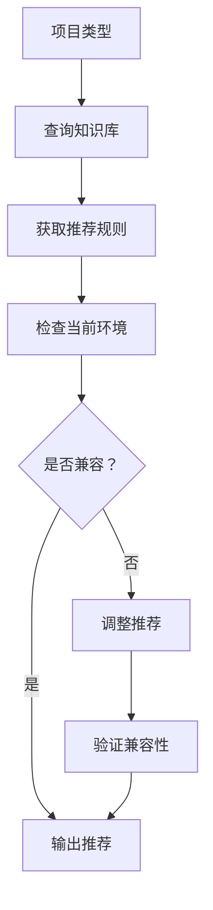
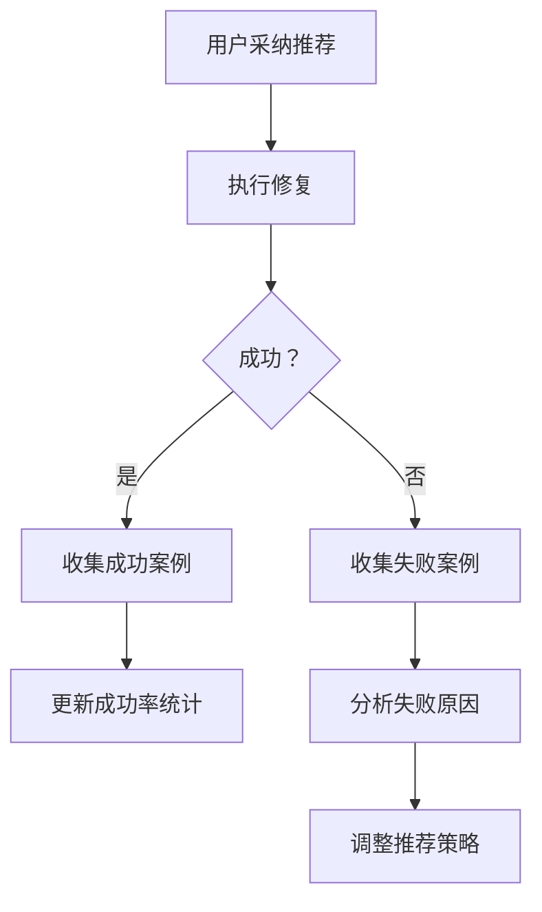
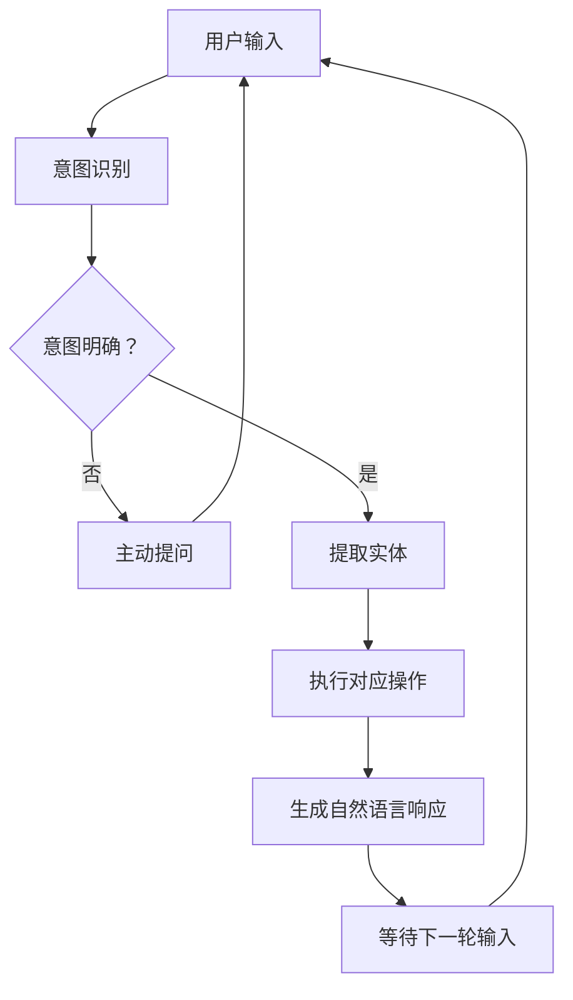
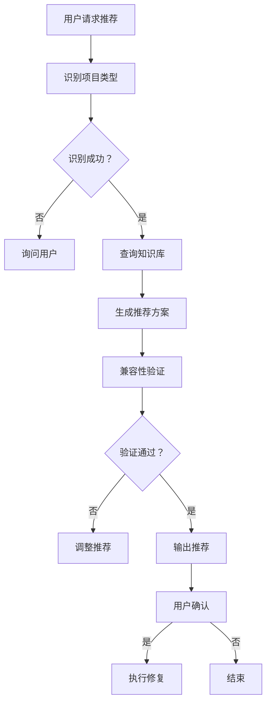

# PyEnv Doctor v1.2 产品需求文档 (PRD)

| 文档版本 | 修改日期 | 修改人 | 备注 |
| :--- | :--- | :--- | :--- |
| v1.0 | 2026-04-24 | 阿零 - 产品领航员 | 基于 v1.1 成果，规划智能化增强版本 |

---

## 1. 产品概述

### 1.1 版本演进路线

| 版本 | 核心能力 | 定位 | 完成状态 |
|:---|:---|:---|:---:|
| **v0.1.5** | 诊断 + 沙箱预演 + 报告导出 | 诊断工具 | ✅ 已完成 |
| **v1.1** | + 自动修复 + 快照回滚 + 策略引擎 | 诊断 + 修复平台 | ⬜ 规划中 |
| **v1.2** | + LLM 集成 + 智能推荐 + 自然语言交互 | 智能化平台 | ⬜ 本 PRD |

### 1.2 v1.2 核心目标

> **从"工具"升级为"智能助手"**

通过集成 LLM（大语言模型），实现自然语言交互和智能诊断建议，降低使用门槛，提升用户体验。

### 1.3 版本定位

| 维度 | v1.1 | v1.2 (目标) | 提升 |
|:---|:---|:---|:---:|
| **交互方式** | CLI 命令 | 自然语言 + CLI | ⬆ |
| **智能化程度** | 规则引擎 | LLM + 规则 | ⬆ |
| **使用门槛** | 需要学习命令 | 自然语言即可 | ⬆ |
| **诊断深度** | 版本冲突检测 | 根因分析 + 建议 | ⬆ |
| **推荐能力** | 基于规则 | 基于知识库 + 上下文 | ⬆ |

### 1.4 目标用户扩展

**v1.1 用户**：
- 熟悉 CLI 的开发者
- 了解 Python 环境管理
- 能理解专业术语

**v1.2 新增用户**：
- Python 初学者（不懂复杂命令）
- 数据科学家（专注业务，不想学工具）
- 跨领域开发者（非 Python 背景）

### 1.5 核心价值主张

**v1.1**："沙箱预演，安全修复"

**v1.2**：**"会说人话，更懂你"**

---

## 2. 功能需求

### 2.1 版本功能清单

| 模块 | 功能 | 优先级 | 验收标准 |
|:---|:---|:---:|:---|
| **LLMIntegration** | LLM 接口封装 | P0 | 支持主流 LLM API |
| **LLMIntegration** | Prompt 工程 | P0 | 准确理解用户意图 |
| **LLMIntegration** | 上下文管理 | P0 | 多轮对话连贯 |
| **NaturalLanguage** | 自然语言诊断 | P0 | 理解用户描述 |
| **NaturalLanguage** | 命令生成 | P0 | 转换为 CLI 命令 |
| **NaturalLanguage** | 结果解释 | P0 | 用自然语言输出 |
| **SmartRecommend** | 项目类型识别 | P1 | 自动识别项目类型 |
| **SmartRecommend** | 版本推荐 | P1 | 基于知识库推荐 |
| **SmartRecommend** | 兼容性检查 | P1 | 推荐前验证兼容 |
| **KnowledgeBase** | 常见问题库 | P1 | 100+ 常见错误模式 |
| **KnowledgeBase** | 解决方案库 | P1 | 500+ 解决方案 |
| **KnowledgeBase** | 自学习机制 | P2 | 从用户反馈学习 |
| **InteractiveChat** | 对话式诊断 | P1 | 多轮问答 |
| **InteractiveChat** | 主动提问 | P1 | 引导用户提供信息 |
| **InteractiveChat** | 进度反馈 | P0 | 自然语言描述进度 |

---

## 3. P0 级功能（必须完成）

### 3.1 LLM 集成（LLM Integration）

#### 3.1.1 LLM 接口封装

**功能描述**：
封装主流 LLM API，提供统一的调用接口。

**支持的 LLM 服务**：
- OpenAI GPT-4 / GPT-3.5
- Anthropic Claude
- 智谱 AI（GLM）
- 通义千问
- 本地模型（Ollama）

**技术方案**：
```python
from abc import ABC, abstractmethod
from typing import Optional, Dict, List

class LLMProvider(ABC):
    @abstractmethod
    def chat(self, messages: List[Dict], **kwargs) -> str:
        """发送对话请求"""
        pass
    
    @abstractmethod
    def complete(self, prompt: str, **kwargs) -> str:
        """完成式调用"""
        pass

class OpenAIProvider(LLMProvider):
    def __init__(self, api_key: str, model: str = "gpt-3.5-turbo"):
        self.api_key = api_key
        self.model = model
    
    def chat(self, messages: List[Dict], **kwargs) -> str:
        # 调用 OpenAI API
        pass

class LocalOllamaProvider(LLMProvider):
    def __init__(self, base_url: str = "http://localhost:11434"):
        self.base_url = base_url
    
    def chat(self, messages: List[Dict], **kwargs) -> str:
        # 调用本地 Ollama
        pass

class LLMFactory:
    @staticmethod
    def create_provider(provider: str, **config) -> LLMProvider:
        """工厂方法创建提供商"""
        providers = {
            "openai": OpenAIProvider,
            "ollama": LocalOllamaProvider,
            # ... 其他提供商
        }
        return providers[provider](**config)
```

**配置管理**：
```ini
# ~/.pyenv-doctor/config.ini
[llm]
provider = openai  # 或 ollama, claude, zhipu
api_key = sk-xxx
model = gpt-3.5-turbo
temperature = 0.7
max_tokens = 1000
```

**验收标准**：
| 测试用例 | 输入 | 预期输出 |
|:---|:---|:---|
| LLM-001 | OpenAI 配置 | 成功调用 GPT |
| LLM-002 | Ollama 本地 | 成功调用本地模型 |
| LLM-003 | 配置错误 | 友好错误提示 |
| LLM-004 | 网络超时 | 重试机制，超时提示 |
| LLM-005 | API 限流 | 降级处理，提示用户 |

---

#### 3.1.2 Prompt 工程

**功能描述**：
设计优化的 Prompt 模板，确保 LLM 准确理解用户意图并生成正确输出。

**核心 Prompt 模板**：

##### 3.1.2.1 意图识别 Prompt

```python
INTENT_RECOGNITION_PROMPT = """
你是一个 Python 环境诊断助手的意图识别模块。请分析用户的输入，识别其意图。

可用意图类别：
1. DIAGNOSE - 诊断环境问题
2. FIX - 修复冲突
3. ROLLBACK - 回滚环境
4. SNAPSHOT - 管理快照
5. EXPLAIN - 解释错误信息
6. RECOMMEND - 推荐版本
7. GENERAL - 一般问题

用户输入：{user_input}

请以 JSON 格式返回：
{{
    "intent": "意图类别",
    "confidence": 置信度 (0-1),
    "entities": {{
        "package_names": ["包名列表"],
        "versions": ["版本号列表"],
        "error_messages": ["错误信息"]
    }},
    "context_needed": true/false  // 是否需要更多上下文
}}
"""
```

##### 3.1.2.2 诊断解释 Prompt

```python
DIAGNOSIS_EXPLANATION_PROMPT = """
你是一个友好的 Python 环境诊断专家。请用通俗易懂的语言解释诊断结果。

诊断结果：
{diagnosis_result}

要求：
1. 先总结问题（1-2 句话）
2. 列出主要冲突（用通俗语言）
3. 给出修复建议（分步骤）
4. 提醒风险（如有）
5. 语气友好，避免专业术语堆砌

示例输出：
"我发现您的环境中有 3 个依赖冲突。主要问题是 numpy 版本过高...
建议您按以下步骤修复：
1. 首先降级 numpy 到 1.23.5
2. 然后...
注意：修复前会自动创建快照，可以放心操作。"
"""
```

##### 3.1.2.3 命令生成 Prompt

```python
COMMAND_GENERATION_PROMPT = """
你是一个 CLI 命令生成器。根据用户意图生成 pyenv-doctor 命令。

可用命令：
- diagnose [--fix] [--strategy conservative|balanced|aggressive]
- snapshot list|create|rollback|delete|export
- recommend --type <project_type>

用户意图：{intent_json}

请生成命令（只返回命令，不要解释）：
命令：pyenv-doctor <command>
"""
```

**验收标准**：
| 测试用例 | 输入 | 预期输出 |
|:---|:---|:---|
| PR-001 | "帮我看看环境问题" | intent=DIAGNOSE, confidence>0.9 |
| PR-002 | "numpy 和 pandas 冲突了" | intent=DIAGNOSE, entities 包含包名 |
| PR-003 | "怎么修复？" | intent=FIX |
| PR-004 | "刚才的快照能恢复吗" | intent=ROLLBACK, 上下文关联 |
| PR-005 | 模糊输入 | confidence<0.6, context_needed=true |

---

#### 3.1.3 上下文管理

**功能描述**：
维护多轮对话的上下文，确保对话连贯性。

**技术方案**：
```python
from dataclasses import dataclass, field
from typing import List, Dict
from datetime import datetime

@dataclass
class Message:
    role: str  # "user" or "assistant"
    content: str
    timestamp: datetime = field(default_factory=datetime.now)
    metadata: Dict = field(default_factory=dict)

@dataclass
class ConversationContext:
    session_id: str
    messages: List[Message] = field(default_factory=list)
    current_diagnosis: Optional[Dict] = None  # 当前诊断结果
    snapshot_id: Optional[str] = None  # 当前快照 ID
    project_type: Optional[str] = None  # 识别的项目类型
    
    def add_message(self, role: str, content: str, **metadata):
        """添加消息"""
        msg = Message(role=role, content=content, metadata=metadata)
        self.messages.append(msg)
    
    def get_recent_messages(self, n: int = 10) -> List[Dict]:
        """获取最近 n 轮对话（用于 LLM 输入）"""
        recent = self.messages[-n:]
        return [{"role": m.role, "content": m.content} for m in recent]
    
    def clear(self):
        """清空上下文（保留 session_id）"""
        self.messages = []
        self.current_diagnosis = None

class ContextManager:
    def __init__(self):
        self.sessions: Dict[str, ConversationContext] = {}
    
    def get_or_create(self, session_id: str) -> ConversationContext:
        """获取或创建会话"""
        if session_id not in self.sessions:
            self.sessions[session_id] = ConversationContext(session_id=session_id)
        return self.sessions[session_id]
    
    def save(self, context: ConversationContext):
        """持久化上下文（可选）"""
        pass
```

**验收标准**：
| 测试用例 | 输入 | 预期输出 |
|:---|:---|:---|
| CM-001 | 首轮对话 | 创建新上下文 |
| CM-002 | 多轮对话 | 上下文连贯 |
| CM-003 | 切换话题 | 识别新话题 |
| CM-004 | 长时间对话 | 上下文不丢失 |
| CM-005 | 会话超时 | 自动清理旧会话 |

---

### 3.2 自然语言交互（Natural Language Interface）

#### 3.2.1 自然语言诊断

**功能描述**：
用户用自然语言描述问题，系统自动执行诊断。

**用户示例**：
```
用户："我的项目运行不了，报错说 numpy 版本不对"
系统："好的，我来帮您诊断环境问题。[执行诊断]...
      发现 3 个冲突，主要是 numpy 版本过高..."
```

**处理流程**：


**验收标准**：
| 测试用例 | 用户输入 | 预期响应 |
|:---|:---|:---|
| NL-001 | "环境有问题" | 执行诊断，输出报告 |
| NL-002 | "numpy 和 pandas 冲突" | 针对性检测这两个包 |
| NL-003 | "安装 xx 后报错" | 诊断 + 解释错误 |
| NL-004 | "帮我看看" | 完整诊断流程 |

---

#### 3.2.2 命令生成

**功能描述**：
将用户自然语言转换为 CLI 命令。

**示例**：
```
用户："我想回滚到昨天的快照"
系统：生成命令：pyenv-doctor snapshot rollback --latest

用户："用保守策略修复"
系统：生成命令：pyenv-doctor diagnose --fix --strategy conservative

用户："导出快照到 requirements.txt"
系统：生成命令：pyenv-doctor snapshot export --latest -o requirements.txt
```

**验收标准**：
| 测试用例 | 用户输入 | 生成命令 |
|:---|:---|:---|
| CG-001 | "列出所有快照" | `pyenv-doctor snapshot list` |
| CG-002 | "创建个快照叫 before-fix" | `pyenv-doctor snapshot create -l before-fix` |
| CG-003 | "回滚到最新" | `pyenv-doctor snapshot rollback --latest` |
| CG-004 | "用激进策略修复" | `pyenv-doctor diagnose --fix --strategy aggressive` |
| CG-005 | "删除旧快照" | `pyenv-doctor snapshot cleanup` |

---

#### 3.2.3 结果解释

**功能描述**：
将技术报告转换为自然语言解释。

**输入**（技术报告）：
```json
{
  "conflicts": [
    {
      "package": "pandas",
      "requires": "numpy<1.24",
      "installed": "1.24.0"
    }
  ],
  "health_score": 65
}
```

**输出**（自然语言）：
```
您的环境健康度为 65 分（满分 100），存在一些问题。

主要问题是 pandas 需要 numpy 版本低于 1.24，但您当前安装的是 1.24.0。
这会导致 pandas 无法正常运行。

建议：降级 numpy 到 1.23.5 版本。
```

**验收标准**：
| 测试用例 | 技术报告 | 自然语言解释 |
|:---|:---|:---|
| RE-001 | 单冲突 | 通俗易懂解释 |
| RE-002 | 多冲突 | 分条列出，清晰 |
| RE-003 | 健康度低 | 语气关切，建议明确 |
| RE-004 | 健康度高 | 肯定现状，提醒注意 |

---

### 3.3 智能推荐（Smart Recommendation）

#### 3.3.1 项目类型识别

**功能描述**：
自动识别项目类型，为推荐提供依据。

**识别方法**：
1. **文件结构分析**：检查项目文件
2. **依赖分析**：分析已安装包
3. **LLM 推理**：基于上下文推断

**识别规则**：
```python
PROJECT_TYPE_PATTERNS = {
    "data-science": {
        "files": ["notebook.ipynb", "data_loader.py"],
        "packages": ["pandas", "numpy", "scikit-learn", "matplotlib"],
        "keywords": ["data", "analysis", "model", "train"]
    },
    "web-backend": {
        "files": ["app.py", "views.py", "models.py"],
        "packages": ["django", "flask", "fastapi", "sqlalchemy"],
        "keywords": ["api", "route", "endpoint", "request"]
    },
    "ml-deep-learning": {
        "files": ["train.py", "model.py"],
        "packages": ["torch", "tensorflow", "transformers"],
        "keywords": ["neural", "network", "gpu", "cuda"]
    },
    "automation-script": {
        "files": ["script.py", "bot.py"],
        "packages": ["selenium", "requests", "beautifulsoup4"],
        "keywords": ["crawl", "scrape", "automate"]
    }
}
```

**验收标准**：
| 测试用例 | 项目特征 | 识别结果 |
|:---|:---|:---|
| PT-001 | 有 pandas+numpy | data-science (置信度>0.8) |
| PT-002 | 有 django+rest_framework | web-backend |
| PT-003 | 有 torch+transformers | ml-deep-learning |
| PT-004 | 混合特征 | 返回多个可能类型 |
| PT-005 | 无法识别 | 提示用户手动选择 |

---

#### 3.3.2 版本推荐

**功能描述**：
基于项目类型和知识库推荐版本组合。

**推荐流程**：


**知识库示例**：
```python
KNOWLEDGE_BASE = {
    "data-science": {
        "stable-stack": {
            "numpy": ">=1.21,<1.25",
            "pandas": ">=1.3,<2.0",
            "scipy": ">=1.7,<1.12",
            "scikit-learn": ">=1.0,<2.0",
            "matplotlib": ">=3.5,<4.0"
        },
        "compatibility_notes": [
            "pandas 2.0 需要 numpy>=1.20",
            "scipy 1.11 与 numpy 1.24 不兼容"
        ]
    },
    "web-backend": {
        "django-stack": {
            "django": ">=3.2,<5.0",
            "djangorestframework": ">=3.13,<4.0",
            "celery": ">=5.2,<6.0"
        }
    }
}
```

**验收标准**：
| 测试用例 | 项目类型 | 推荐结果 |
|:---|:---|:---|
| VR-001 | data-science | 推荐稳定版本组合 |
| VR-002 | web-backend | 推荐 Django 生态 |
| VR-003 | 当前已兼容 | 提示无需变更 |
| VR-004 | 有冲突 | 推荐解决方案 |
| VR-005 | 多项目类型 | 推荐兼顾方案 |

---

#### 3.3.3 兼容性检查

**功能描述**：
推荐前验证版本兼容性，避免推荐无效方案。

**验证方法**：
1. **规则验证**：检查版本约束
2. **沙箱验证**：在沙箱中测试安装
3. **社区数据**：查询 PyPI 和 GitHub issues

**验收标准**：
| 测试用例 | 推荐方案 | 兼容性检查 |
|:---|:---|:---|
| VC-001 | 已知兼容 | 通过，标记"已验证" |
| VC-002 | 未知组合 | 沙箱验证 |
| VC-003 | 已知不兼容 | 拒绝推荐，提示原因 |
| VC-004 | 部分兼容 | 标记风险，提醒用户 |

---

### 3.4 交互式对话（Interactive Chat）

#### 3.4.1 对话式诊断

**功能描述**：
支持多轮问答，逐步深入诊断。

**对话示例**：
```
用户：我的项目运行不了
助手：好的，请问是什么类型的错误？是导入错误还是运行时错误？

用户：导入错误，说找不到 numpy
助手：明白了。让我先检查一下您的环境...[扫描环境]
      发现 numpy 未安装。您是否需要安装 numpy？

用户：需要
助手：好的，推荐安装 numpy==1.24.0（最新稳定版）。
      是否执行安装？[y/N]

用户：y
助手：[执行安装]... 安装成功！
      还有其他需要帮助的吗？
```

**验收标准**：
| 测试用例 | 对话场景 | 预期表现 |
|:---|:---|:---|
| IC-001 | 模糊问题 | 主动追问澄清 |
| IC-002 | 多轮对话 | 上下文连贯 |
| IC-003 | 切换话题 | 识别并适应 |
| IC-004 | 回到之前话题 | 回忆上下文 |

---

#### 3.4.2 主动提问

**功能描述**：
当信息不足时，主动引导用户提供信息。

**提问策略**：
```python
QUESTION_TEMPLATES = {
    "clarify_error": "请问错误信息是什么？可以复制粘贴给我看看吗？",
    "clarify_project": "这是什么类型的项目？（Web/数据科学/机器学习/其他）",
    "clarify_timing": "这个问题是什么时候开始的？最近有更新什么包吗？",
    "confirm_action": "我将执行 XX 操作，这会影响 N 个包，是否继续？[y/N]",
    "feedback": "修复后问题解决了吗？还有其他需要帮助的吗？"
}
```

**验收标准**：
| 测试用例 | 场景 | 提问 |
|:---|:---|:---|
| AQ-001 | 信息不足 | 主动追问 |
| AQ-002 | 模糊描述 | 引导具体化 |
| AQ-003 | 执行前 | 确认影响范围 |
| AQ-004 | 完成后 | 询问反馈 |

---

#### 3.4.3 进度反馈

**功能描述**：
用自然语言描述操作进度，而非冷冰冰的进度条。

**示例**：
```
传统输出：
[REPAIR] (3/5) [████████░░] 60%

自然语言：
"正在修复第 3 个冲突（共 5 个）...
 已经修复了 numpy 和 requests，
 当前正在处理 pandas，大约还需要 30 秒..."
```

**验收标准**：
| 测试用例 | 操作阶段 | 自然语言描述 |
|:---|:---|:---|
| PF-001 | 开始修复 | "开始修复，共 N 个冲突" |
| PF-002 | 进行中 | "已完成 X 个，当前处理 Y" |
| PF-003 | 接近完成 | "就快完成了，还剩 N 个" |
| PF-004 | 完成 | "全部完成！耗时 X 秒" |

---

## 4. P1 级功能（建议完成）

### 4.1 知识库（Knowledge Base）

#### 4.1.1 常见问题库

**功能描述**：
积累常见错误模式和解决方案。

**数据结构**：
```python
@dataclass
class ErrorPattern:
    id: str
    error_message_pattern: str  # 错误信息正则
    cause: str  # 根因解释
    solution: str  # 解决方案
    related_packages: List[str]
    frequency: int  # 出现频率
    success_rate: float  # 解决成功率

# 示例
ERROR_PATTERNS = [
    ErrorPattern(
        id="ERR-001",
        error_message_pattern=r"ImportError:.*numpy",
        cause="numpy 未安装或版本不兼容",
        solution="安装或降级 numpy",
        related_packages=["numpy", "pandas", "scipy"],
        frequency=1520,
        success_rate=0.95
    ),
    ErrorPattern(
        id="ERR-002",
        error_message_pattern=r"ModuleNotFoundError:.*'pkg_resources'",
        cause="setuptools 缺失或损坏",
        solution="pip install --upgrade setuptools",
        related_packages=["setuptools"],
        frequency=890,
        success_rate=0.98
    )
]
```

**验收标准**：
| 测试用例 | 要求 | 验收 |
|:---|:---|:---|
| KB-001 | 常见问题覆盖 | >= 100 个错误模式 |
| KB-002 | 匹配准确率 | > 90% |
| KB-003 | 解决成功率 | > 85% |

---

#### 4.1.2 解决方案库

**功能描述**：
积累典型场景的解决方案。

**场景示例**：
```python
SOLUTION_TEMPLATES = {
    "numpy-pandas-conflict": {
        "title": "numpy 与 pandas 版本冲突",
        "steps": [
            "1. 创建快照：pyenv-doctor snapshot create -l before-fix",
            "2. 降级 numpy：pip install numpy==1.23.5",
            "3. 验证：python -c 'import pandas; print(pandas.__version__)'"
        ],
        "notes": "pandas 1.5.x 需要 numpy<1.24",
        "success_rate": 0.96
    },
    "torch-cuda-mismatch": {
        "title": "PyTorch 与 CUDA 版本不匹配",
        "steps": [
            "1. 检查 CUDA 版本：nvcc --version",
            "2. 安装对应 PyTorch：参考 pytorch.org",
            "3. 验证：python -c 'import torch; print(torch.cuda.is_available())'"
        ],
        "notes": "不同 CUDA 版本需要不同的 PyTorch wheel",
        "success_rate": 0.89
    }
}
```

**验收标准**：
| 测试用例 | 要求 | 验收 |
|:---|:---|:---|
| SL-001 | 典型场景覆盖 | >= 500 个解决方案 |
| SL-002 | 方案质量 | 成功率 > 85% |
| SL-003 | 更新机制 | 可从社区贡献更新 |

---

#### 4.1.3 自学习机制

**功能描述**：
从用户反馈中学习，不断优化推荐。

**学习流程**：


**验收标准**：
| 测试用例 | 功能 | 验收 |
|:---|:---|:---|
| SL-001 | 成功案例收集 | 自动记录 |
| SL-002 | 失败分析 | 识别原因 |
| SL-003 | 策略调整 | 基于反馈优化 |

---

## 5. 技术架构

### 5.1 整体架构

```
PyEnv Doctor v1.2
├── User Interface Layer
│   ├── CLI（传统命令）
│   └── Natural Language Interface（新增）
│       ├── Intent Recognition
│       ├── Entity Extraction
│       └── Response Generation
├── AI Layer（新增）
│   ├── LLM Provider Interface
│   ├── Prompt Engineering
│   ├── Context Management
│   └── Knowledge Base
├── Intelligence Layer（新增）
│   ├── Smart Recommendation
│   ├── Project Type Recognition
│   └── Compatibility Checker
├── Core Layer（v1.1 已有）
│   ├── EnvScanner
│   ├── ConflictSolver
│   ├── SandboxExecutor
│   ├── AutoRepair
│   ├── RollbackEngine
│   └── SnapshotManager
└── Tool Layer
    ├── pip_tool
    └── venv_tool
```

### 5.2 项目目录结构扩展

```
pyenv-doctor/
├── src/
│   └── pyenv_doctor/
│       ├── ...（v1.1 已有模块）
│       ├── ai/（新增）
│       │   ├── __init__.py
│       │   ├── llm_providers/
│       │   │   ├── __init__.py
│       │   │   ├── base.py
│       │   │   ├── openai_provider.py
│       │   │   ├── ollama_provider.py
│       │   │   └── ...
│       │   ├── prompts/
│       │   │   ├── __init__.py
│       │   │   ├── intent_recognition.py
│       │   │   ├── diagnosis_explanation.py
│       │   │   └── command_generation.py
│       │   └── context.py
│       ├── intelligence/（新增）
│       │   ├── __init__.py
│       │   ├── recommender.py
│       │   ├── project_classifier.py
│       │   └── knowledge_base.py
│       └── cli/
│           ├── ...（v1.1 已有）
│           └── chat.py（新增：对话式 CLI）
├── data/
│   └── knowledge_base/（新增）
│       ├── error_patterns.json
│       ├── solution_templates.json
│       └── project_type_rules.json
└── tests/
    └── ...（v1.1 已有）
        ├── test_ai/（新增）
        └── test_intelligence/（新增）
```

### 5.3 数据结构扩展

#### 5.3.1 UserIntent（用户意图）

```python
from enum import Enum
from typing import Dict, List, Optional

class IntentType(Enum):
    DIAGNOSE = "diagnose"
    FIX = "fix"
    ROLLBACK = "rollback"
    SNAPSHOT = "snapshot"
    EXPLAIN = "explain"
    RECOMMEND = "recommend"
    GENERAL = "general"

@dataclass
class UserIntent:
    type: IntentType
    confidence: float
    entities: Dict[str, List[str]]
    context_needed: bool
    raw_input: str  # 原始输入
    
    def to_llm_message(self) -> str:
        """转换为 LLM 消息"""
        pass
```

#### 5.3.2 Recommendation（推荐方案）

```python
@dataclass
class Recommendation:
    package: str
    current_version: str
    recommended_version: str
    reason: str
    confidence: float
    verified: bool  # 是否已验证兼容
    risk_level: str  # low/medium/high
    source: str  # 推荐来源（rule-based/llm/community）
    
    def to_natural_language(self) -> str:
        """转换为自然语言解释"""
        return f"建议将 {self.package} 从 {self.current_version} " \
               f"{'升级' if self.recommended_version > self.current_version else '降级'} " \
               f"到 {self.recommended_version}，因为{self.reason}"
```

#### 5.3.3 ConversationSession（对话会话）

```python
@dataclass
class ConversationSession:
    session_id: str
    user_id: Optional[str]
    started_at: datetime
    last_activity: datetime
    messages: List[Message]
    context: ConversationContext
    diagnosis_result: Optional[Dict]
    actions_taken: List[str]  # 执行过的操作
    
    def is_expired(self, timeout_hours: int = 24) -> bool:
        """检查是否超时"""
        pass
```

---

## 6. CLI 命令扩展

### 6.1 chat 命令（新增）

```bash
# 对话模式
pyenv-doctor chat [OPTIONS]

Options:
  --provider TEXT    LLM 提供商 [openai|ollama|claude]
  --model TEXT       模型名称
  --session TEXT     会话 ID（继续之前对话）
  --verbose          显示详细对话日志
  --help

# 交互式对话
$ pyenv-doctor chat

欢迎使用 PyEnv Doctor 智能助手！
您可以用自然语言描述问题，例如：
  - "我的项目运行不了，报错说 numpy 版本不对"
  - "帮我看看环境有什么问题"
  - "怎么修复 pandas 和 numpy 的冲突？"

您：我的项目运行不了
助手：好的，请问是什么类型的错误？是导入错误还是运行时错误？

您：导入错误，说找不到 numpy
助手：明白了，让我检查一下您的环境...
```

### 6.2 diagnose 命令扩展

```bash
# 增加自然语言选项
pyenv-doctor diagnose [OPTIONS]

Options:
  --fix              自动修复（v1.1 已有）
  --explain          用自然语言解释结果（新增）
  --recommend        给出智能推荐（新增）
  --strategy TEXT    修复策略（v1.1 已有）
  ...（其他 v1.1 选项）

# 示例
$ pyenv-doctor diagnose --explain --recommend

[诊断结果]
发现 3 个依赖冲突...

[智能解读]
您的环境主要问题是 numpy 版本过高，导致 pandas 和 scipy 都无法正常工作...

[推荐方案]
基于您的项目类型（数据科学），建议：
1. 降级 numpy 到 1.23.5
2. 保持 pandas 1.5.3
3. 升级 scipy 到 1.10.0
```

### 6.3 recommend 命令（新增）

```bash
pyenv-doctor recommend [OPTIONS]

Options:
  --type TEXT        项目类型 [auto|data-science|web-backend|ml-deep-learning]
  --explain          解释推荐原因
  --verify           沙箱验证推荐方案
  --apply            直接应用推荐（相当于 diagnose --fix --strategy balanced）
  --help

# 示例
$ pyenv-doctor recommend --type auto --explain --verify

[项目类型识别]
检测到您的项目使用了 pandas、numpy、matplotlib，判断为：数据科学项目（置信度 0.89）

[推荐版本组合]
numpy: 1.23.5 (当前 1.24.0) ⬇ 降级
pandas: 1.5.3 (当前 1.5.3) ✓ 保持
scipy: 1.10.0 (当前 1.9.0) ⬆ 升级

[兼容性验证]
✓ 沙箱验证通过，推荐方案可安全安装
```

---

## 7. 用户交互流程

### 7.1 对话式诊断流程



### 7.2 智能推荐流程



---

## 8. 非功能性需求

### 8.1 性能要求

| 操作 | 性能指标 | 备注 |
|:---|:---|:---|
| 意图识别 | < 2 秒 | 包含 LLM 调用时间 |
| 响应生成 | < 3 秒 | 自然语言解释 |
| 项目类型识别 | < 1 秒 | 规则匹配 |
| 推荐生成 | < 5 秒 | 包含兼容性验证 |
| 对话响应 | < 3 秒 | 端到端延迟 |

### 8.2 准确性要求

| 指标 | 要求 | 测量方法 |
|:---|:---|:---|
| 意图识别准确率 | > 90% | 测试集验证 |
| 项目类型识别准确率 | > 85% | 真实项目测试 |
| 推荐采纳率 | > 70% | 用户行为统计 |
| 推荐成功率 | > 85% | 执行后验证 |
| 用户满意度 | > 4.0/5.0 | 反馈评分 |

### 8.3 隐私与安全

- **API Key 保护**：本地存储，加密传输
- **对话数据**：默认不上传，本地存储
- **敏感信息**：自动过滤（如密码、token）
- **本地模型优先**：支持 Ollama 等本地部署

### 8.4 可用性要求

- **离线模式**：本地模型支持离线使用
- **降级处理**：LLM 不可用时回退到规则引擎
- **多语言支持**：中文 + 英文（未来扩展）

---

## 9. 测试用例

### 9.1 LLM 集成测试

| 用例 ID | 测试场景 | 操作步骤 | 预期结果 |
|:---|:---|:---|:---|
| LLM-001 | OpenAI 调用 | 配置 OpenAI，发送请求 | 成功响应 |
| LLM-002 | Ollama 本地 | 启动 Ollama，调用 | 本地模型响应 |
| LLM-003 | 配置错误 | 错误 API Key | 友好错误提示 |
| LLM-004 | 网络超时 | 模拟网络延迟 | 超时提示，可重试 |
| LLM-005 | API 限流 | 高频调用 | 降级处理 |

### 9.2 意图识别测试

| 用例 ID | 用户输入 | 预期意图 | 置信度 |
|:---|:---|:---|:---|
| IR-001 | "帮我看看环境问题" | DIAGNOSE | > 0.9 |
| IR-002 | "numpy 和 pandas 冲突了" | DIAGNOSE | > 0.85 |
| IR-003 | "怎么修复？" | FIX | > 0.8 |
| IR-004 | "回滚到昨天" | ROLLBACK | > 0.85 |
| IR-005 | "这是什么意思？" | EXPLAIN | > 0.7 |
| IR-006 | 模糊输入 | GENERAL | < 0.6 |

### 9.3 自然语言诊断测试

| 用例 ID | 用户输入 | 预期行为 |
|:---|:---|:---|
| NL-001 | "项目运行不了" | 执行诊断 |
| NL-002 | "导入错误，找不到 numpy" | 检查 numpy |
| NL-003 | "安装 xx 后报错" | 诊断 + 解释 |
| NL-004 | "环境健康吗？" | 完整诊断 |

### 9.4 智能推荐测试

| 用例 ID | 项目类型 | 推荐验证 |
|:---|:---|:---|
| SR-001 | data-science | 推荐 pandas/numpy 兼容版本 |
| SR-002 | web-backend | 推荐 Django 生态 |
| SR-003 | ml-deep-learning | 推荐 torch/tensorflow |
| SR-004 | 混合类型 | 推荐兼顾方案 |
| SR-005 | 无法识别 | 提示用户选择 |

### 9.5 对话式交互测试

| 用例 ID | 对话场景 | 预期表现 |
|:---|:---|:---|
| IC-001 | 首轮对话 | 创建上下文 |
| IC-002 | 多轮追问 | 上下文连贯 |
| IC-003 | 切换话题 | 识别新话题 |
| IC-004 | 回到之前 | 回忆上下文 |

---

## 10. 开发计划

### 10.1 详细任务拆分（5 天）

| 天数 | 任务 | 具体工作 | 产出 | 优先级 |
|:---:|:---|:---|:---|:---:|
| **Day 1** | LLM 接口封装 | - 实现 Provider 基类<br>- OpenAI/Ollama 适配<br>- 配置管理 | 可调用 LLM | P0 |
| **Day 2** | Prompt 工程 | - 意图识别 Prompt<br>- 解释生成 Prompt<br>- 命令生成 Prompt | Prompt 模板库 | P0 |
| **Day 3** | 自然语言交互 | - 意图识别模块<br>- 命令生成器<br>- 结果解释器 | chat 命令可用 | P0 |
| **Day 4** | 智能推荐 | - 项目类型识别<br>- 知识库查询<br>- 兼容性验证 | recommend 命令 | P1 |
| **Day 5** | 集成测试 + 发布 | - 端到端测试<br>- Bug 修复<br>- PyPI 发布 | v1.2 发布 | P0 |

### 10.2 每日验收标准

| 天数 | 验收标准 | 验证方法 |
|:---:|:---|:---|
| Day 1 | 可调用 LLM | `pyenv-doctor chat` 连接成功 |
| Day 2 | Prompt 优化 | 意图识别准确率 > 85% |
| Day 3 | 对话可用 | 自然语言诊断流程完整 |
| Day 4 | 推荐可用 | 项目类型识别 + 推荐生成 |
| Day 5 | 端到端测试 | 完整对话流程测试通过 |

---

## 11. 风险评估与应对

| 风险 | 可能性 | 影响 | 应对措施 |
|:---|:---:|:---:|:---|
| **LLM 响应不准确** | 中 | 高 | - Prompt 优化<br>- 后处理验证<br>- 用户反馈机制 |
| **API 成本高** | 中 | 中 | - 支持本地模型<br>- 限流控制<br>- 缓存常用响应 |
| **网络依赖** | 高 | 中 | - 本地模型优先<br>- 离线模式<br>- 降级到规则引擎 |
| **隐私担忧** | 中 | 中 | - 默认本地存储<br>- 敏感信息过滤<br>- 明确隐私政策 |
| **过度依赖 LLM** | 中 | 低 | - 规则引擎兜底<br>- 核心逻辑不依赖 LLM |
| **响应速度慢** | 中 | 中 | - 流式输出<br>- 超时控制<br>- 并发优化 |

---

## 12. 简历亮点（v1.2）

| 亮点 | 描述 | 技术深度 | 面试话题 |
|:---|:---|:---:|:---|
| **LLM 集成** | 多 LLM 提供商适配，Prompt 工程 | ⭐⭐⭐⭐⭐ | LLM 应用、Prompt 优化 |
| **自然语言交互** | 意图识别、实体提取、对话管理 | ⭐⭐⭐⭐⭐ | NLP、对话系统 |
| **智能推荐** | 基于知识库 + 上下文的个性化推荐 | ⭐⭐⭐⭐ | 推荐系统、知识图谱 |
| **项目类型识别** | 规则 + 机器学习的项目分类 | ⭐⭐⭐⭐ | 分类算法、特征工程 |
| **自学习机制** | 从用户反馈中持续优化 | ⭐⭐⭐⭐ | 强化学习、在线学习 |
| **本地模型支持** | Ollama 等本地部署，保护隐私 | ⭐⭐⭐ | 边缘计算、隐私保护 |

---

## 13. 与竞品对比（v1.2 完成后）

| 工具 | 冲突检测 | 自动修复 | LLM 交互 | 智能推荐 | 知识库 |
|:---|:---:|:---:|:---:|:---:|:---:|
| pipdeptree | ❌ | ❌ | ❌ | ❌ | ❌ |
| pip-check | ⚠️ | ❌ | ❌ | ❌ | ❌ |
| **PyEnv Doctor v1.1** | ✅ | ✅ | ❌ | ⚠️ 基础 | ❌ |
| **PyEnv Doctor v1.2** | **✅** | **✅** | **✅** | **✅** | **✅** |

**核心竞争力**：业界首个集成 LLM 的 Python 环境管理工具

---

## 14. 验收标准总览

### 14.1 功能验收

| 功能模块 | 验收标准 | 优先级 | 状态 |
|:---|:---|:---:|:---:|
| LLM 接口 | 支持 >= 2 个提供商 | P0 | ⬜ |
| 意图识别 | 准确率 > 90% | P0 | ⬜ |
| 自然语言诊断 | 可理解用户描述 | P0 | ⬜ |
| 命令生成 | 正确转换自然语言 | P0 | ⬜ |
| 结果解释 | 通俗易懂 | P0 | ⬜ |
| 项目类型识别 | 准确率 > 85% | P1 | ⬜ |
| 智能推荐 | 推荐合理，可验证 | P1 | ⬜ |
| 对话管理 | 多轮连贯 | P1 | ⬜ |
| 知识库 | >= 100 错误模式 | P1 | ⬜ |

### 14.2 性能验收

| 指标 | 要求 | 实测 | 状态 |
|:---|:---|:---|:---:|
| 意图识别 | < 2 秒 | ⬜ | ⬜ |
| 响应生成 | < 3 秒 | ⬜ | ⬜ |
| 推荐生成 | < 5 秒 | ⬜ | ⬜ |
| 对话延迟 | < 3 秒 | ⬜ | ⬜ |

### 14.3 质量验收

| 指标 | 要求 | 实测 | 状态 |
|:---|:---|:---|:---:|
| 意图识别准确率 | > 90% | ⬜ | ⬜ |
| 推荐采纳率 | > 70% | ⬜ | ⬜ |
| 用户满意度 | > 4.0/5.0 | ⬜ | ⬜ |

---

## 15. 文档要求

### 15.1 必须更新的文档

- ✅ README.md：更新 v1.2 新功能
- ✅ CHANGELOG.md：记录 v1.2 变更
- ✅ CLI 帮助：chat/recommend 命令帮助

### 15.2 新增文档

- ⬜ CHAT_GUIDE.md：对话式使用指南
- ⬜ LLM_SETUP.md：LLM 配置指南
- ⬜ INTELLIGENCE.md：智能推荐说明

---

## 16. 总结

### 16.1 v1.2 核心价值

> **从"工具"到"智能助手"的跨越**

- **对用户**：降低使用门槛，自然语言即可交互
- **对简历**：LLM 应用、NLP、推荐系统等热门技术
- **对产品**：差异化竞争，技术壁垒更高

### 16.2 技术亮点

1. **LLM 集成**：多提供商适配，Prompt 工程
2. **自然语言交互**：意图识别、对话管理
3. **智能推荐**：知识库 + 上下文个性化推荐
4. **项目类型识别**：规则 + 推理的项目分类

### 16.3 成功标准

✅ **功能完整**：P0 功能 100% 完成  
✅ **准确性达标**：意图识别 > 90%，推荐 > 85%  
✅ **性能达标**：响应时间 < 3 秒  
✅ **用户体验好**：对话自然流畅  
✅ **PyPI 发布**：v1.2 成功发布  

---

<div align="center">

**PyEnv Doctor v1.2 - 会说人话，更懂你**

[⬆ 返回顶部](#pyenv-doctor-v12-产品需求文档-prd)

</div>
