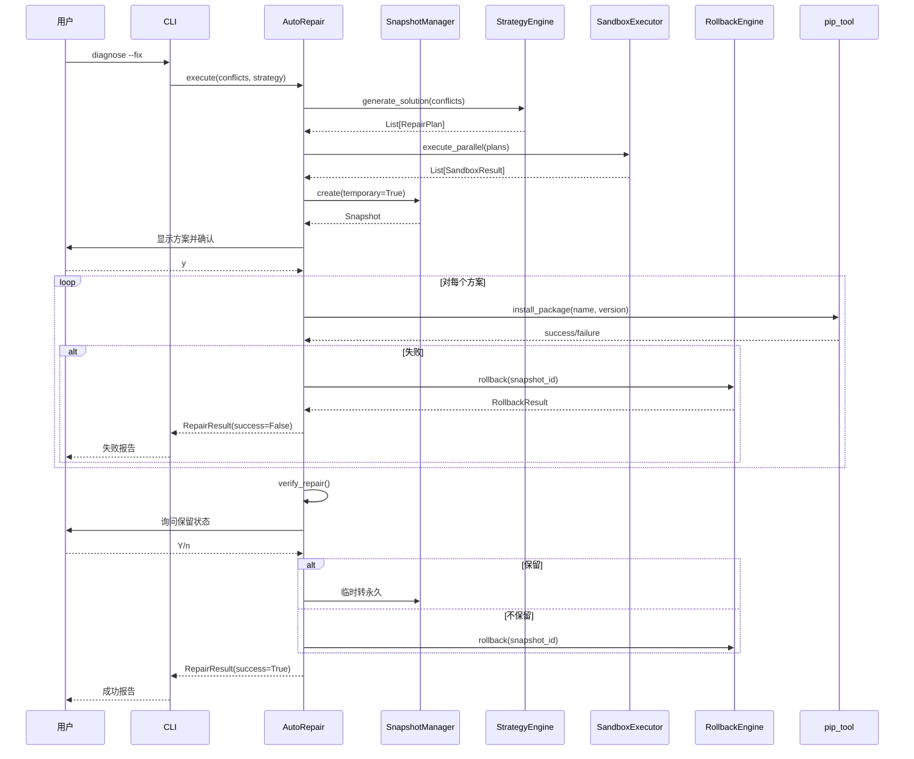
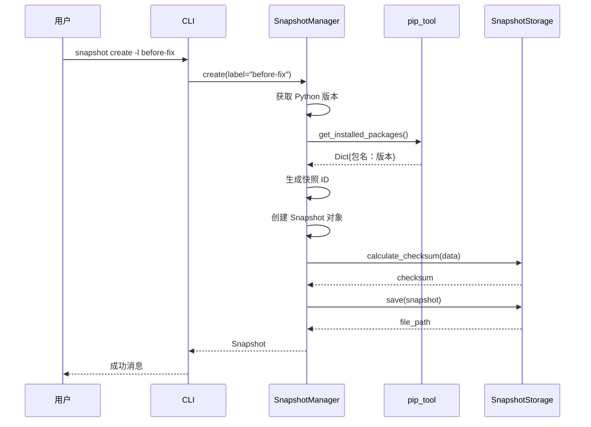
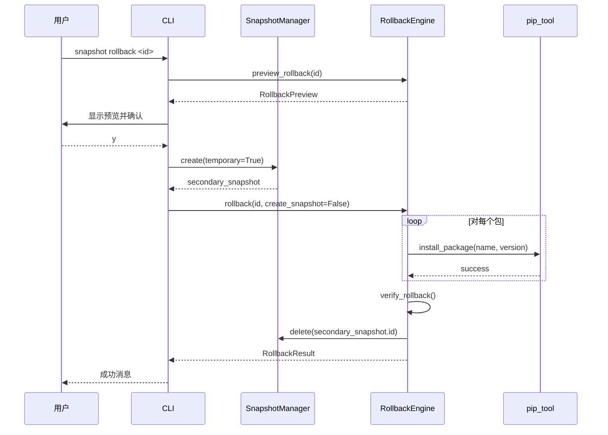
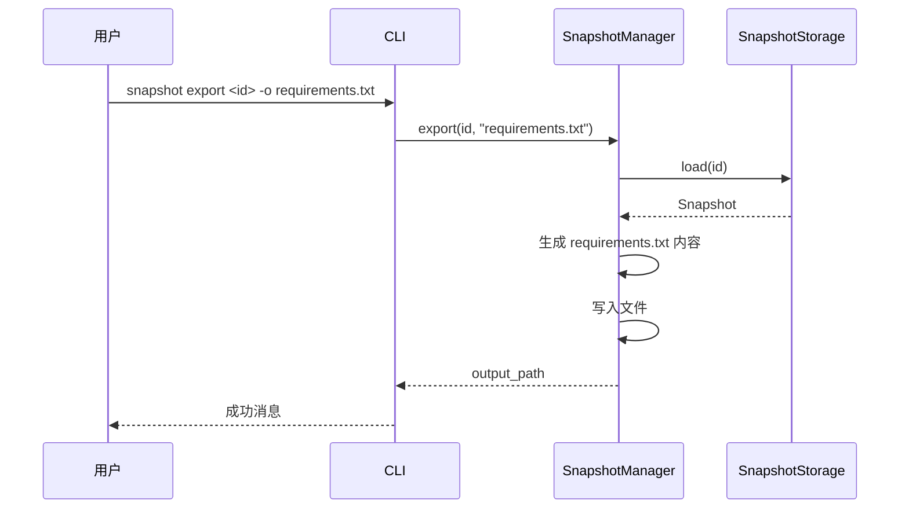

# PyEnv Doctor v1.1 软件详细设计文档 (SDD)

| 文档版本 | 修改日期 | 修改人 | 备注 |
| :--- | :--- | :--- | :--- |
| v1.0 | 2026-04-24 | 需求规格师 | 初始版本，基于 PRD v1.1 |
| v1.1 | 2026-04-24 | 需求规格师 | 版本升级，完全对应 PRD v1.1 所有功能需求 |

---

## 目录

1. [系统架构设计](#1-系统架构设计)
2. [模块详细设计](#2-模块详细设计)
3. [数据结构定义](#3-数据结构定义)
4. [接口定义](#4-接口定义)
5. [业务流程](#5-业务流程)
6. [异常处理设计](#6-异常处理设计)
7. [与现有模块集成](#7-与现有模块集成)
8. [CLI 命令详细设计](#8-cli 命令详细设计)
9. [性能优化设计](#9-性能优化设计)
10. [安全性设计](#10-安全性设计)
11. [配置管理](#11-配置管理)
12. [日志设计](#12-日志设计)
13. [版本兼容性](#13-版本兼容性)
14. [附录](#14-附录)

---

## 1. 系统架构设计

### 1.1 整体架构图

```
┌─────────────────────────────────────────────────────────────┐
│                        CLI Layer (Click)                     │
├─────────────────────────────────────────────────────────────┤
│  diagnose 命令 (已有)  │  snapshot 子命令 (新增)  │  repair  │
└─────────────────────────────────────────────────────────────┘
                              │
                              ▼
┌─────────────────────────────────────────────────────────────┐
│                      Agents Layer (已有)                     │
├─────────────────────────────────────────────────────────────┤
│   EnvScanner  │  ConflictSolver  │  SandboxExecutor         │
└─────────────────────────────────────────────────────────────┘
                              │
                              ▼
┌─────────────────────────────────────────────────────────────┐
│                    Repair Layer (新增)                       │
├─────────────────────────────────────────────────────────────┤
│   AutoRepair  │  RollbackEngine  │  StrategyEngine          │
└─────────────────────────────────────────────────────────────┘
                              │
                              ▼
┌─────────────────────────────────────────────────────────────┐
│                   Snapshot Layer (新增)                      │
├─────────────────────────────────────────────────────────────┤
│   SnapshotManager  │  SnapshotStorage                       │
└─────────────────────────────────────────────────────────────┘
                              │
                              ▼
┌─────────────────────────────────────────────────────────────┐
│                     Tool Layer (已有)                        │
├─────────────────────────────────────────────────────────────┤
│   pip_tool  │  venv_tool                                    │
└─────────────────────────────────────────────────────────────┘
```

### 1.2 模块依赖关系

| 模块 | 依赖模块 | 依赖类型 | 说明 |
|:---|:---|:---|:---|
| `cli.snapshot` | `snapshot.manager` | 强依赖 | CLI 调用管理器 |
| `cli.repair` | `repair.auto_repair` | 强依赖 | CLI 调用修复器 |
| `repair.auto_repair` | `snapshot.manager` | 强依赖 | 修复前创建快照 |
| `repair.auto_repair` | `repair.rollback` | 强依赖 | 失败时回滚 |
| `repair.auto_repair` | `repair.strategy` | 强依赖 | 获取修复方案 |
| `repair.rollback` | `snapshot.manager` | 强依赖 | 从快照恢复 |
| `snapshot.manager` | `snapshot.storage` | 强依赖 | 存储快照数据 |
| `snapshot.manager` | `tools.pip_tool` | 弱依赖 | 获取包列表 |
| `snapshot.manager` | `tools.venv_tool` | 弱依赖 | 获取环境信息 |

### 1.3 目录结构

```
pyenv-doctor/
├── src/
│   └── pyenv_doctor/
│       ├── __init__.py
│       ├── cli/
│       │   ├── __init__.py
│       │   ├── diagnose.py          # 已有，扩展 --fix 选项
│       │   ├── snapshot.py          # 新增：snapshot 子命令
│       │   └── repair.py            # 新增：repair 子命令（可选）
│       ├── agents/                   # 保持不变
│       │   ├── __init__.py
│       │   ├── env_scanner.py
│       │   ├── conflict_solver.py
│       │   └── sandbox_executor.py
│       ├── repair/                   # 新增
│       │   ├── __init__.py
│       │   ├── auto_repair.py        # 自动修复引擎
│       │   ├── rollback.py           # 回滚引擎
│       │   └── strategy.py           # 策略引擎
│       ├── snapshot/                 # 新增
│       │   ├── __init__.py
│       │   ├── manager.py            # 快照管理器
│       │   └── storage.py            # 快照存储
│       ├── models/
│       │   ├── __init__.py
│       │   └── schemas.py            # 扩展数据结构
│       └── tools/                    # 保持不变
│           ├── __init__.py
│           ├── pip_tool.py
│           └── venv_tool.py
├── tests/
│   ├── __init__.py
│   ├── test_snapshot/                # 新增
│   │   ├── __init__.py
│   │   ├── test_manager.py
│   │   └── test_storage.py
│   └── test_repair/                  # 新增
│       ├── __init__.py
│       ├── test_auto_repair.py
│       ├── test_rollback.py
│       └── test_strategy.py
└── docs/
    ├── PyEnv_Doctor_SDD_v1.0.md      # 历史版本
    └── PyEnv_Doctor_SDD_v1.1.md    # 本文档
```

---

## 2. 模块详细设计

### 2.1 Snapshot Layer（快照层）

#### 2.1.1 SnapshotStorage 类

**职责**：负责快照的持久化存储、读取、校验

**文件路径**：`src/pyenv_doctor/snapshot/storage.py`

**类定义**：

```python
class SnapshotStorage:
    """快照存储引擎"""
    
    def __init__(self, storage_dir: Optional[str] = None):
        """
        初始化存储引擎
        
        Args:
            storage_dir: 存储目录，默认为 ~/.pyenv-doctor/snapshots
        """
        pass
    
    def save(self, snapshot: Snapshot) -> str:
        """
        保存快照到磁盘
        
        Args:
            snapshot: 快照对象
            
        Returns:
            保存的文件路径
            
        异常:
            StorageError: 保存失败时抛出
        """
        pass
    
    def load(self, snapshot_id: str) -> Snapshot:
        """
        从磁盘加载快照
        
        Args:
            snapshot_id: 快照 ID
            
        Returns:
            快照对象
            
        异常:
            SnapshotNotFoundError: 快照不存在
            ChecksumError: 校验和验证失败
        """
        pass
    
    def exists(self, snapshot_id: str) -> bool:
        """检查快照是否存在"""
        pass
    
    def delete(self, snapshot_id: str) -> None:
        """
        删除快照
        
        异常:
            SnapshotNotFoundError: 快照不存在
        """
        pass
    
    def list_all(self) -> List[Snapshot]:
        """列出所有快照，按时间倒序"""
        pass
    
    def calculate_checksum(self, data: Dict) -> str:
        """
        计算 SHA256 校验和
        
        Args:
            data: 快照字典数据
            
        Returns:
            SHA256 校验和字符串（格式：sha256:xxx）
        """
        pass
```

**存储格式**：

- **目录**：`~/.pyenv-doctor/snapshots/`
- **文件命名**：`{snapshot_id}.json`
- **文件内容**：JSON 格式，UTF-8 编码

**校验和算法**：
```python
import hashlib
import json

def calculate_checksum(data: Dict) -> str:
    # 序列化时按键排序，确保一致性
    json_str = json.dumps(data, sort_keys=True, separators=(',', ':'))
    sha256_hash = hashlib.sha256(json_str.encode('utf-8')).hexdigest()
    return f"sha256:{sha256_hash}"
```

#### 2.1.2 SnapshotManager 类

**职责**：快照业务逻辑管理，创建、列表、回滚、删除、导出

**文件路径**：`src/pyenv_doctor/snapshot/manager.py`

**类定义**：

```python
class SnapshotManager:
    """快照管理器"""
    
    def __init__(self, storage: Optional[SnapshotStorage] = None):
        """
        初始化快照管理器
        
        Args:
            storage: 存储引擎，默认创建实例
        """
        pass
    
    def create(
        self, 
        label: Optional[str] = None,
        temporary: bool = False
    ) -> Snapshot:
        """
        创建快照
        
        Args:
            label: 用户标签（可选）
            temporary: 是否为临时快照
            
        Returns:
            创建的快照对象
            
        异常:
            SnapshotCreateError: 创建失败时抛出
        """
        pass
    
    def list_snapshots(self, limit: Optional[int] = None) -> List[Snapshot]:
        """
        列出快照
        
        Args:
            limit: 限制数量，None 表示全部
            
        Returns:
            快照列表，按时间倒序
        """
        pass
    
    def rollback(
        self, 
        snapshot_id: str,
        verify: bool = True
    ) -> RollbackResult:
        """
        回滚到指定快照
        
        Args:
            snapshot_id: 快照 ID
            verify: 是否回滚后验证
            
        Returns:
            回滚结果对象
            
        异常:
            SnapshotNotFoundError: 快照不存在
            RollbackError: 回滚失败
        """
        pass
    
    def delete(
        self, 
        snapshot_id: str,
        force: bool = False
    ) -> None:
        """
        删除快照
        
        Args:
            snapshot_id: 快照 ID
            force: 强制删除，不验证
            
        异常:
            SnapshotNotFoundError: 快照不存在
        """
        pass
    
    def export(
        self, 
        snapshot_id: str,
        output_path: str,
        format: str = "requirements"
    ) -> str:
        """
        导出快照
        
        Args:
            snapshot_id: 快照 ID
            output_path: 输出文件路径
            format: 导出格式 [requirements|json]
            
        Returns:
            实际输出路径
            
        异常:
            SnapshotNotFoundError: 快照不存在
            ExportError: 导出失败
        """
        pass
    
    def cleanup_temporary(self) -> int:
        """
        清理所有临时快照
        
        Returns:
            删除的快照数量
        """
        pass
    
    def get_latest(self) -> Optional[Snapshot]:
        """
        获取最新快照
        
        Returns:
            最新快照，无快照返回 None
        """
        pass
```

**创建快照流程**：

```python
def create(self, label: Optional[str] = None, temporary: bool = False) -> Snapshot:
    # 1. 获取 Python 版本
    python_version = sys.version.split()[0]
    
    # 2. 获取虚拟环境路径（如果在 venv 中）
    venv_path = sys.prefix if hasattr(sys, 'real_prefix') or \
                           (hasattr(sys, 'base_prefix') and sys.base_prefix != sys.prefix) \
                else None
    
    # 3. 获取包列表
    packages = pip_tool.get_installed_packages()
    
    # 4. 生成快照 ID
    timestamp = datetime.now()
    random_str = ''.join(random.choices('abcdefghijklmnopqrstuvwxyz0123456789', k=6))
    snapshot_id = f"{timestamp.strftime('%Y%m%d_%H%M%S')}_{random_str}"
    
    # 5. 创建快照对象
    snapshot = Snapshot(
        id=snapshot_id,
        timestamp=timestamp,
        label=label,
        python_version=python_version,
        venv_path=venv_path,
        packages=packages,
        total_packages=len(packages),
        checksum="",  # 待计算
        is_temporary=temporary
    )
    
    # 6. 计算校验和
    data = snapshot.to_dict()
    snapshot.checksum = self.storage.calculate_checksum(data)
    
    # 7. 保存到磁盘
    self.storage.save(snapshot)
    
    return snapshot
```

---

### 2.2 Repair Layer（修复层）

#### 2.2.1 StrategyEngine 类

**职责**：根据策略生成修复方案

**文件路径**：`src/pyenv_doctor/repair/strategy.py`

**枚举定义**：

```python
from enum import Enum

class RepairStrategy(Enum):
    """修复策略枚举"""
    CONSERVATIVE = "conservative"  # 保守：只降级
    BALANCED = "balanced"          # 平衡：最小改动（默认）
    AGGRESSIVE = "aggressive"      # 激进：升最新
```

**类定义**：

```python
class StrategyEngine:
    """修复策略引擎"""
    
    def __init__(self, conflict_solver: ConflictSolver):
        """
        初始化策略引擎
        
        Args:
            conflict_solver: 冲突检测器（已有）
        """
        pass
    
    def generate_solution(
        self,
        conflicts: List[Conflict],
        strategy: RepairStrategy = RepairStrategy.BALANCED
    ) -> List[RepairPlan]:
        """
        生成修复方案
        
        Args:
            conflicts: 冲突列表
            strategy: 修复策略
            
        Returns:
            修复方案列表
            
        异常:
            NoSolutionError: 无可行方案
        """
        pass
    
    def _conservative_strategy(
        self, 
        conflicts: List[Conflict]
    ) -> List[RepairPlan]:
        """
        保守策略：只降级冲突包
        
        规则：
        1. 识别冲突包
        2. 找到满足所有约束的最低版本
        3. 只降级，不升级
        """
        pass
    
    def _balanced_strategy(
        self, 
        conflicts: List[Conflict]
    ) -> List[RepairPlan]:
        """
        平衡策略：最小改动
        
        规则：
        1. 降级 + 升级，最小变更
        2. 选择满足约束的中间版本
        3. 优先降级基础包
        """
        pass
    
    def _aggressive_strategy(
        self, 
        conflicts: List[Conflict]
    ) -> List[RepairPlan]:
        """
        激进策略：升级最新兼容版本
        
        规则：
        1. 全部升级到最新兼容版本
        2. 优先满足新版本特性
        3. 可能引入较多变更
        """
        pass
    
    def sort_by_dependency(
        self, 
        plans: List[RepairPlan]
    ) -> List[RepairPlan]:
        """
        根据依赖关系排序修复顺序
        
        算法：拓扑排序
        
        Args:
            plans: 修复方案列表
            
        Returns:
            排序后的方案列表
        """
        pass
```

**策略对比表**：

| 策略 | 降级 | 升级 | 变更范围 | 适用场景 |
|:---|:---:|:---:|:---|:---|
| 保守 | ✅ | ❌ | 最小 | 生产环境 |
| 平衡 | ✅ | ✅ | 中等 | 开发环境（默认） |
| 激进 | ✅ | ✅ | 最大 | 新项目/追求最新 |

#### 2.2.2 AutoRepair 类

**职责**：执行自动修复，包含进度显示、验证、回滚

**文件路径**：`src/pyenv_doctor/repair/auto_repair.py`

**类定义**：

```python
class AutoRepair:
    """自动修复引擎"""
    
    def __init__(
        self,
        snapshot_manager: SnapshotManager,
        rollback_engine: RollbackEngine,
        strategy_engine: StrategyEngine,
        sandbox_executor: SandboxExecutor
    ):
        """
        初始化自动修复器
        
        Args:
            snapshot_manager: 快照管理器
            rollback_engine: 回滚引擎
            strategy_engine: 策略引擎
            sandbox_executor: 沙箱执行器（已有）
        """
        pass
    
    def execute(
        self,
        conflicts: List[Conflict],
        strategy: RepairStrategy = RepairStrategy.BALANCED,
        dry_run: bool = False,
        skip_confirm: bool = False,
        parallel: bool = True,
        workers: int = 4
    ) -> RepairResult:
        """
        执行自动修复
        
        Args:
            conflicts: 冲突列表
            strategy: 修复策略
            dry_run: 只预览不执行
            skip_confirm: 跳过用户确认
            parallel: 是否并行预演
            workers: 工作线程数
            
        Returns:
            修复结果
            
        异常:
            RepairFailedError: 修复失败
        """
        pass
    
    def _create_temp_snapshot(self) -> Snapshot:
        """创建临时快照"""
        pass
    
    def _execute_plan(
        self, 
        plan: RepairPlan,
        progress_callback: Optional[Callable] = None
    ) -> bool:
        """
        执行单个修复方案
        
        Args:
            plan: 修复方案
            progress_callback: 进度回调函数
            
        Returns:
            是否成功
        """
        pass
    
    def _verify_repair(self) -> VerificationResult:
        """验证修复结果"""
        pass
    
    def _show_progress(
        self, 
        current: int, 
        total: int, 
        plan: RepairPlan,
        elapsed: float
    ):
        """
        显示修复进度
        
        格式：
        [REPAIR] 修复进度 (3/5) [████████░░] 60%
          ✓ numpy==1.23.5 (5.2s)
          ✓ requests==2.27.1 (3.8s)
          ⏳ pandas==1.5.3 (正在安装... 已用 12.5s)
        """
        pass
```

**修复流程**：

```python
def execute(self, conflicts: List[Conflict], ...) -> RepairResult:
    start_time = time.time()
    
    # 1. 生成修复方案
    plans = self.strategy_engine.generate_solution(conflicts, strategy)
    
    # 2. 沙箱预演（并行）
    if not dry_run:
        preview_results = self.sandbox_executor.execute_parallel(
            plans, 
            workers=workers
        )
        # 过滤失败的方案
        plans = [p for p, r in zip(plans, preview_results) if r.success]
    
    # 3. 创建临时快照
    snapshot = self._create_temp_snapshot()
    
    # 4. 用户确认
    if not skip_confirm and not dry_run:
        confirm = input("[AUTO-FIX] 是否执行修复？[y/N]: ")
        if confirm.lower() != 'y':
            return RepairResult(
                success=False,
                repaired=[],
                failed=[],
                snapshot_id=snapshot.id,
                duration=0,
                strategy=strategy.value,
                rollback_available=True,
                cancelled_by_user=True
            )
    
    # 5. 执行修复
    repaired = []
    failed = []
    for i, plan in enumerate(plans):
        success = self._execute_plan(
            plan,
            progress_callback=lambda: self._show_progress(i+1, len(plans), plan, time.time()-start_time)
        )
        if success:
            repaired.append(plan.package_name)
        else:
            failed.append(plan.package_name)
            # 失败立即回滚
            self.rollback_engine.rollback(snapshot.id)
            raise RepairFailedError(f"修复失败：{plan.package_name}")
    
    # 6. 验证修复结果
    verification = self._verify_repair()
    if not verification.passed:
        self.rollback_engine.rollback(snapshot.id)
        raise RepairFailedError("验证失败，已回滚")
    
    # 7. 返回结果
    return RepairResult(
        success=True,
        repaired=repaired,
        failed=failed,
        snapshot_id=snapshot.id,
        duration=time.time() - start_time,
        strategy=strategy.value,
        rollback_available=True
    )
```

#### 2.2.3 RollbackEngine 类

**职责**：执行回滚操作

**文件路径**：`src/pyenv_doctor/repair/rollback.py`

**类定义**：

```python
class RollbackEngine:
    """回滚引擎"""
    
    def __init__(self, snapshot_manager: SnapshotManager):
        """
        初始化回滚引擎
        
        Args:
            snapshot_manager: 快照管理器
        """
        pass
    
    def rollback(
        self,
        snapshot_id: str,
        create_snapshot: bool = True,
        verify: bool = True
    ) -> RollbackResult:
        """
        执行回滚
        
        Args:
            snapshot_id: 快照 ID
            create_snapshot: 回滚前是否创建当前状态快照
            verify: 回滚后是否验证
            
        Returns:
            回滚结果
            
        异常:
            SnapshotNotFoundError: 快照不存在
            RollbackError: 回滚失败
        """
        pass
    
    def rollback_to_latest(self) -> RollbackResult:
        """
        回滚到最新快照
        
        Returns:
            回滚结果
        """
        pass
    
    def preview_rollback(self, snapshot_id: str) -> RollbackPreview:
        """
        预览回滚影响
        
        Args:
            snapshot_id: 快照 ID
            
        Returns:
            回滚预览对象
        """
        pass
    
    def _restore_packages(
        self, 
        packages: Dict[str, str],
        progress_callback: Optional[Callable] = None
    ) -> bool:
        """
        恢复包版本
        
        Args:
            packages: {包名：版本}
            progress_callback: 进度回调
            
        Returns:
            是否成功
        """
        pass
    
    def _verify_rollback(self, snapshot: Snapshot) -> bool:
        """
        验证回滚结果
        
        Args:
            snapshot: 快照对象
            
        Returns:
            是否验证通过
        """
        pass
```

**回滚流程**：

```python
def rollback(self, snapshot_id: str, create_snapshot: bool = True, verify: bool = True) -> RollbackResult:
    start_time = time.time()
    
    # 1. 加载快照
    snapshot = self.snapshot_manager.storage.load(snapshot_id)
    
    # 2. 回滚前创建二次快照（可选）
    if create_snapshot:
        secondary_snapshot = self.snapshot_manager.create(
            label=f"before-rollback-{snapshot_id}",
            temporary=True
        )
    
    # 3. 恢复包版本
    success = self._restore_packages(
        snapshot.packages,
        progress_callback=lambda: self._show_rollback_progress(...)
    )
    
    if not success:
        raise RollbackError("回滚失败")
    
    # 4. 验证回滚
    if verify:
        passed = self._verify_rollback(snapshot)
        if not passed:
            raise RollbackError("回滚验证失败")
    
    # 5. 清理二次快照（回滚成功）
    if create_snapshot:
        self.snapshot_manager.delete(secondary_snapshot.id)
    
    return RollbackResult(
        success=True,
        snapshot_id=snapshot_id,
        packages_restored=snapshot.total_packages,
        duration=time.time() - start_time,
        verified=verify
    )
```

---

### 2.3 CLI Layer（命令行层）

#### 2.3.1 snapshot 子命令

**文件路径**：`src/pyenv_doctor/cli/snapshot.py`

**命令结构**：

```python
import click

@click.group()
def snapshot():
    """快照管理命令"""
    pass

@snapshot.command()
@click.option('-l', '--label', help='快照标签')
@click.option('--temporary', is_flag=True, help='创建临时快照')
def create(label, temporary):
    """创建新快照"""
    manager = SnapshotManager()
    snapshot = manager.create(label=label, temporary=temporary)
    click.echo(f"[OK] 快照创建成功：{snapshot.id}")

@snapshot.command()
@click.option('--json', 'json_output', is_flag=True, help='JSON 格式输出')
@click.option('--limit', type=int, help='限制显示数量')
def list(json_output, limit):
    """列出所有快照"""
    manager = SnapshotManager()
    snapshots = manager.list_snapshots(limit=limit)
    
    if json_output:
        click.echo(json.dumps([s.to_dict() for s in snapshots], indent=2))
    else:
        # 表格输出
        _print_snapshot_table(snapshots)

@snapshot.command()
@click.argument('snapshot_id', required=False)
@click.option('--latest', is_flag=True, help='回滚到最新快照')
@click.option('--dry-run', is_flag=True, help='预览不回滚')
@click.option('--yes', is_flag=True, help='跳过确认')
@click.option('--verify/--no-verify', default=True, help='回滚后验证')
def rollback(snapshot_id, latest, dry_run, yes, verify):
    """回滚到指定快照"""
    manager = SnapshotManager()
    
    # 确定快照 ID
    if latest:
        snapshot = manager.get_latest()
        if not snapshot:
            click.echo("[ERROR] 没有快照可回滚")
            return
        snapshot_id = snapshot.id
    elif not snapshot_id:
        click.echo("[ERROR] 请指定快照 ID 或使用 --latest")
        return
    
    # 预览
    if dry_run:
        preview = rollback_engine.preview_rollback(snapshot_id)
        _print_rollback_preview(preview)
        return
    
    # 用户确认
    if not yes:
        confirm = click.prompt("是否继续回滚？[y/N]", default='n')
        if confirm.lower() != 'y':
            return
    
    # 执行回滚
    result = manager.rollback(snapshot_id, verify=verify)
    _print_rollback_result(result)

@snapshot.command()
@click.argument('snapshot_ids', nargs=-1)
@click.option('--yes', is_flag=True, help='跳过确认')
def delete(snapshot_ids, yes):
    """删除快照"""
    manager = SnapshotManager()
    
    if not snapshot_ids:
        click.echo("[ERROR] 请指定要删除的快照 ID")
        return
    
    if not yes:
        confirm = click.prompt(f"确认删除 {len(snapshot_ids)} 个快照？[y/N]", default='n')
        if confirm.lower() != 'y':
            return
    
    for sid in snapshot_ids:
        manager.delete(sid)
        click.echo(f"[OK] 已删除 {sid}")

@snapshot.command()
@click.argument('snapshot_id')
@click.option('-o', '--output', type=click.Path(), help='输出文件路径')
@click.option('--format', type=click.Choice(['requirements', 'json']), default='requirements')
def export(snapshot_id, output, format):
    """导出快照"""
    manager = SnapshotManager()
    output_path = output or 'requirements.txt'
    result_path = manager.export(snapshot_id, output_path, format=format)
    click.echo(f"[OK] 已导出到 {result_path}")

@snapshot.command()
@click.option('--temporary', is_flag=True, help='只清理临时快照')
def cleanup(temporary):
    """清理临时快照"""
    manager = SnapshotManager()
    if temporary:
        count = manager.cleanup_temporary()
        click.echo(f"[OK] 清理了 {count} 个临时快照")
```

#### 2.3.2 diagnose 命令扩展

**文件路径**：`src/pyenv_doctor/cli/diagnose.py`

**新增选项**：

```python
@diagnose.command()
@click.option('--fix', is_flag=True, help='自动执行修复')
@click.option('--strategy', type=click.Choice(['conservative', 'balanced', 'aggressive']), 
              default='balanced', help='修复策略')
@click.option('--dry-run', is_flag=True, help='只显示不执行')
@click.option('--yes', is_flag=True, help='跳过确认')
def diagnose(fix, strategy, dry_run, yes, ...):
    """诊断环境冲突"""
    
    # 原有逻辑：扫描、检测冲突、沙箱预演
    
    if fix:
        # 执行自动修复
        repair_result = auto_repair.execute(
            conflicts=conflicts,
            strategy=RepairStrategy(strategy),
            dry_run=dry_run,
            skip_confirm=yes
        )
        _print_repair_result(repair_result)
```

---

## 3. 数据结构定义

### 3.1 Snapshot（快照）

```python
@dataclass
class Snapshot:
    """环境快照"""
    
    id: str
    """
    快照 ID
    格式：YYYYMMDD_HHMMSS_random(6)
    示例：20260424_143022_a1b2c3
    校验规则：正则表达式 `^\d{8}_\d{6}_[a-z0-9]{6}$`
    """
    
    timestamp: datetime
    """
    创建时间
    格式：datetime 对象
    序列化：ISO 8601 格式 (YYYY-MM-DDTHH:MM:SS.ffffff)
    """
    
    label: Optional[str]
    """
    用户标签
    约束：最大长度 50 字符，允许字母、数字、中划线、下划线
    校验规则：`^[a-zA-Z0-9_-]{0,50}$`
    示例："before-upgrade", "before-fix"
    """
    
    python_version: str
    """
    Python 版本
    格式：主版本。次版本。补丁版本
    示例："3.9.18", "3.11.5"
    校验规则：`^\d+\.\d+\.\d+$`
    """
    
    venv_path: Optional[str]
    """
    虚拟环境路径
    约束：绝对路径
    示例："D:\\projects\\myproject\\.venv"
    """
    
    packages: Dict[str, str]
    """
    包版本字典
    键：包名（小写，PEP 503 标准化）
    值：版本号
    示例：{"numpy": "1.24.0", "pandas": "1.5.3"}
    包名校验：`^[a-z0-9][a-z0-9._-]*[a-z0-9]$`
    版本校验：语义化版本或 PEP 440
    """
    
    total_packages: int
    """
    包总数
    约束：>= 0
    计算：len(packages)
    """
    
    checksum: str
    """
    SHA256 校验和
    格式：sha256:hex(64)
    示例："sha256:abc123def456..."
    校验规则：`^sha256:[a-f0-9]{64}$`
    """
    
    is_temporary: bool
    """
    是否为临时快照
    True: 临时快照（自动修复创建，可自动清理）
    False: 永久快照
    """
    
    def to_dict(self) -> Dict:
        """转换为字典（用于 JSON 序列化）"""
        return {
            'id': self.id,
            'timestamp': self.timestamp.isoformat(),
            'label': self.label,
            'python_version': self.python_version,
            'venv_path': self.venv_path,
            'packages': self.packages,
            'total_packages': self.total_packages,
            'checksum': self.checksum,
            'is_temporary': self.is_temporary
        }
    
    @classmethod
    def from_dict(cls, data: Dict) -> 'Snapshot':
        """从字典创建"""
        return cls(
            id=data['id'],
            timestamp=datetime.fromisoformat(data['timestamp']),
            label=data.get('label'),
            python_version=data['python_version'],
            venv_path=data.get('venv_path'),
            packages=data['packages'],
            total_packages=data['total_packages'],
            checksum=data['checksum'],
            is_temporary=data['is_temporary']
        )
    
    def calculate_checksum(self) -> str:
        """计算校验和"""
        data = self.to_dict()
        del data['checksum']  # 排除自身
        return SnapshotStorage.calculate_checksum(data)
    
    def verify_checksum(self) -> bool:
        """验证校验和"""
        expected = self.calculate_checksum()
        return self.checksum == expected
```

### 3.2 RepairPlan（修复方案）

```python
@dataclass
class RepairPlan:
    """单个包的修复方案"""
    
    package_name: str
    """
    包名
    校验：PEP 503 标准化名称
    """
    
    current_version: str
    """
    当前版本
    示例："1.24.0"
    """
    
    target_version: str
    """
    目标版本
    示例："1.23.5"
    """
    
    action: str
    """
    操作类型
    枚举值：
      - "upgrade": 升级 (target_version > current_version)
      - "downgrade": 降级 (target_version < current_version)
      - "reinstall": 重装 (target_version == current_version)
    """
    
    reason: str
    """
    修复原因
    示例："pandas requires numpy<1.24"
    """
    
    dependencies: List[str]
    """
    依赖的包列表
    用于拓扑排序
    """
    
    def to_command(self) -> str:
        """生成 pip 命令"""
        return f"pip install {self.package_name}=={self.target_version}"
```

### 3.3 RepairResult（修复结果）

```python
@dataclass
class RepairResult:
    """修复结果"""
    
    success: bool
    """
    是否成功
    True: 所有包修复成功
    False: 有包修复失败或用户取消
    """
    
    repaired: List[str]
    """
    成功修复的包列表
    示例：["numpy", "requests"]
    """
    
    failed: List[str]
    """
    修复失败的包列表
    示例：["pandas"]
    """
    
    snapshot_id: str
    """
    关联的快照 ID
    用于回滚
    """
    
    duration: float
    """
    耗时（秒）
    精度：小数点后 1 位
    示例：45.3
    """
    
    strategy: str
    """
    使用的策略
    枚举值："conservative", "balanced", "aggressive"
    """
    
    rollback_available: bool
    """
    是否可回滚
    True: 有快照，可回滚
    """
    
    cancelled_by_user: bool = False
    """
    是否被用户取消
    """
    
    def to_report(self) -> str:
        """生成人类可读的报告"""
        if self.cancelled_by_user:
            return "[CANCELLED] 用户取消修复"
        
        if self.success:
            lines = [
                "[SUCCESS] 修复完成！",
                f"  - 修复了 {len(self.repaired)} 个冲突",
                f"  - 耗时：{self.duration:.1f}秒",
                f"  - 策略：{self.strategy}",
                f"  - 快照 ID: {self.snapshot_id}",
                f"  - 回滚命令：pyenv-doctor snapshot rollback {self.snapshot_id}"
            ]
            return '\n'.join(lines)
        else:
            lines = [
                "[FAILED] 修复失败",
                f"  - 成功：{len(self.repaired)} 个",
                f"  - 失败：{len(self.failed)} 个",
                f"  - 已自动回滚到快照 {self.snapshot_id}"
            ]
            return '\n'.join(lines)
```

### 3.4 RollbackResult（回滚结果）

```python
@dataclass
class RollbackResult:
    """回滚结果"""
    
    success: bool
    """是否成功"""
    
    snapshot_id: str
    """回滚的快照 ID"""
    
    packages_restored: int
    """恢复的包数量"""
    
    duration: float
    """耗时（秒）"""
    
    verified: bool
    """是否验证通过"""
    
    def to_report(self) -> str:
        """生成报告"""
        if self.success:
            return (
                f"[OK] 回滚成功！\n"
                f"  - 恢复 {self.packages_restored} 个包\n"
                f"  - 耗时：{self.duration:.1f}秒\n"
                f"  - 验证：{'通过' if self.verified else '未验证'}"
            )
        else:
            return f"[FAILED] 回滚失败"
```

### 3.5 RollbackPreview（回滚预览）

```python
@dataclass
class RollbackPreview:
    """回滚预览"""
    
    snapshot_id: str
    """快照 ID"""
    
    changes: List[PackageChange]
    """包变更列表"""
    
    total_changes: int
    """变更总数"""
    
    def to_text(self) -> str:
        """生成预览文本"""
        lines = [
            f"[DRY-RUN] 回滚预览:",
            f"将恢复以下包 ({self.total_changes} 个):"
        ]
        for change in self.changes:
            lines.append(
                f"  - {change.package_name}: {change.current_version} → {change.target_version}"
            )
        return '\n'.join(lines)

@dataclass
class PackageChange:
    """包变更"""
    package_name: str
    current_version: str
    target_version: str
```

### 3.6 VerificationResult（验证结果）

```python
@dataclass
class VerificationResult:
    """验证结果"""
    
    passed: bool
    """是否通过"""
    
    verified_packages: int
    """验证的包数量"""
    
    failed_packages: List[str]
    """验证失败的包列表"""
    
    checksum_valid: bool
    """校验和是否有效"""
    
    def to_report(self) -> str:
        """生成报告"""
        if self.passed:
            return f"[VERIFY] 验证通过 ({self.verified_packages} 个包)"
        else:
            return (
                f"[VERIFY] 验证失败\n"
                f"  - 验证：{self.verified_packages} 个包\n"
                f"  - 失败：{self.failed_packages}"
            )
```

---

## 4. 接口定义

### 4.1 内部接口

#### 4.1.1 SnapshotManager 接口

| 方法 | 输入参数 | 返回值 | 异常 | 说明 |
|:---|:---|:---|:---|:---|
| `create` | `label: Optional[str]`, `temporary: bool` | `Snapshot` | `SnapshotCreateError` | 创建快照 |
| `list_snapshots` | `limit: Optional[int]` | `List[Snapshot]` | 无 | 列出快照 |
| `rollback` | `snapshot_id: str`, `verify: bool` | `RollbackResult` | `SnapshotNotFoundError`, `RollbackError` | 回滚 |
| `delete` | `snapshot_id: str`, `force: bool` | `None` | `SnapshotNotFoundError` | 删除 |
| `export` | `snapshot_id: str`, `output_path: str`, `format: str` | `str` | `SnapshotNotFoundError`, `ExportError` | 导出 |
| `cleanup_temporary` | 无 | `int` | 无 | 清理临时快照 |
| `get_latest` | 无 | `Optional[Snapshot]` | 无 | 获取最新 |

#### 4.1.2 AutoRepair 接口

| 方法 | 输入参数 | 返回值 | 异常 | 说明 |
|:---|:---|:---|:---|:---|
| `execute` | `conflicts: List[Conflict]`, `strategy: RepairStrategy`, `dry_run: bool`, `skip_confirm: bool`, `parallel: bool`, `workers: int` | `RepairResult` | `RepairFailedError` | 执行修复 |

#### 4.1.3 RollbackEngine 接口

| 方法 | 输入参数 | 返回值 | 异常 | 说明 |
|:---|:---|:---|:---|:---|
| `rollback` | `snapshot_id: str`, `create_snapshot: bool`, `verify: bool` | `RollbackResult` | `SnapshotNotFoundError`, `RollbackError` | 回滚 |
| `rollback_to_latest` | 无 | `RollbackResult` | `SnapshotNotFoundError`, `RollbackError` | 回滚到最新 |
| `preview_rollback` | `snapshot_id: str` | `RollbackPreview` | `SnapshotNotFoundError` | 预览回滚 |

#### 4.1.4 StrategyEngine 接口

| 方法 | 输入参数 | 返回值 | 异常 | 说明 |
|:---|:---|:---|:---|:---|
| `generate_solution` | `conflicts: List[Conflict]`, `strategy: RepairStrategy` | `List[RepairPlan]` | `NoSolutionError` | 生成方案 |
| `sort_by_dependency` | `plans: List[RepairPlan]` | `List[RepairPlan]` | 无 | 依赖排序 |

### 4.2 外部接口

#### 4.2.1 pip_tool 接口（已有）

```python
# 获取已安装的包
def get_installed_packages() -> Dict[str, str]:
    """
    Returns:
        {包名：版本}
    """
    pass

# 安装指定版本的包
def install_package(name: str, version: str) -> bool:
    """
    Args:
        name: 包名
        version: 版本号
        
    Returns:
        是否成功
    """
    pass

# 卸载包
def uninstall_package(name: str) -> bool:
    """
    Returns:
        是否成功
    """
    pass
```

#### 4.2.2 venv_tool 接口（已有）

```python
# 获取虚拟环境信息
def get_venv_info() -> VenvInfo:
    """
    Returns:
        虚拟环境信息对象
    """
    pass

# 检查写权限
def has_write_permission() -> bool:
    """
    Returns:
        是否有写权限
    """
    pass
```

#### 4.2.3 ConflictSolver 接口（已有）

```python
# 检测冲突
def detect_conflicts() -> List[Conflict]:
    """
    Returns:
        冲突列表
    """
    pass
```

#### 4.2.4 SandboxExecutor 接口（已有）

```python
# 并行执行沙箱预演
def execute_parallel(
    plans: List[RepairPlan], 
    workers: int = 4
) -> List[SandboxResult]:
    """
    Args:
        plans: 修复方案列表
        workers: 工作线程数
        
    Returns:
        预演结果列表
    """
    pass
```

---

## 5. 业务流程

### 5.1 自动修复完整流程



### 5.2 快照创建流程



### 5.3 回滚流程



### 5.4 快照导出流程



**导出文件格式**：

```
# PyEnv Doctor Snapshot Export
# Created: 2026-04-24 14:30:22
# Python: 3.9.18
# Packages: 280
# Snapshot ID: 20260424_143022_a1b2c3
# -------------------------
numpy==1.23.5
pandas==1.5.3
requests==2.27.1
...
```

---

## 6. 异常处理设计

### 6.1 异常分类

| 异常类型 | 继承自 | 触发场景 | 用户消息 |
|:---|:---|:---|:---|
| `SnapshotError` | `Exception` | 快照操作基类 | - |
| `SnapshotNotFoundError` | `SnapshotError` | 快照不存在 | "快照 {id} 不存在" |
| `SnapshotCreateError` | `SnapshotError` | 创建快照失败 | "创建快照失败：{原因}" |
| `ChecksumError` | `SnapshotError` | 校验和验证失败 | "快照校验和验证失败，可能已损坏" |
| `RollbackError` | `Exception` | 回滚操作基类 | - |
| `RollbackFailedError` | `RollbackError` | 回滚失败 | "回滚失败：{原因}" |
| `RepairFailedError` | `Exception` | 修复失败 | "修复失败：{包名}" |
| `NoSolutionError` | `Exception` | 无可行方案 | "无法找到满足所有约束的解决方案" |
| `ExportError` | `Exception` | 导出失败 | "导出失败：{原因}" |
| `PermissionError` | `Exception` | 权限不足 | "权限不足，请在虚拟环境中运行或使用 sudo" |

### 6.2 异常处理策略

#### 6.2.1 修复失败处理

```python
try:
    result = auto_repair.execute(conflicts, strategy)
except RepairFailedError as e:
    # 已自动回滚
    click.echo(f"[FAILED] {str(e)}")
    click.echo("[INFO] 环境已恢复到修复前状态")
    click.echo("[INFO] 快照已保留，可手动回滚：pyenv-doctor snapshot rollback <id>")
    sys.exit(1)
```

#### 6.2.2 回滚失败处理

```python
try:
    result = rollback_engine.rollback(snapshot_id)
except RollbackFailedError as e:
    click.echo(f"[CRITICAL] 回滚失败：{str(e)}")
    click.echo("[ERROR] 环境可能处于不一致状态")
    click.echo("[INFO] 建议手动检查：pip list")
    click.echo("[INFO] 或重新创建虚拟环境")
    sys.exit(1)
```

#### 6.2.3 快照校验和失败

```python
try:
    snapshot = storage.load(snapshot_id)
    if not snapshot.verify_checksum():
        raise ChecksumError("校验和不匹配")
except ChecksumError as e:
    click.echo(f"[ERROR] 快照损坏：{str(e)}")
    click.echo("[INFO] 建议删除此快照：pyenv-doctor snapshot delete {id}")
    sys.exit(1)
```

### 6.3 重试机制

| 操作 | 重试次数 | 重试间隔 | 触发条件 |
|:---|:---:|:---:|:---|
| pip install | 3 | 2 秒 | 网络超时、临时错误 |
| 快照保存 | 2 | 0.5 秒 | 磁盘 IO 错误 |
| 快照加载 | 2 | 0.5 秒 | 文件读取错误 |

**重试装饰器**：

```python
import functools
import time

def retry(max_attempts=3, delay=2.0, exceptions=(Exception,)):
    def decorator(func):
        @functools.wraps(func)
        def wrapper(*args, **kwargs):
            for attempt in range(max_attempts):
                try:
                    return func(*args, **kwargs)
                except exceptions as e:
                    if attempt == max_attempts - 1:
                        raise
                    time.sleep(delay)
            return None
        return wrapper
    return decorator

@retry(max_attempts=3, delay=2.0, exceptions=(pip.exceptions.NetworkError,))
def install_package_with_retry(name: str, version: str) -> bool:
    return pip_tool.install_package(name, version)
```

---

## 7. 与现有模块集成

### 7.1 与 EnvScanner 集成

**集成点**：无直接集成

**说明**：快照创建时通过 `pip_tool.get_installed_packages()` 获取包列表，而非通过 EnvScanner。EnvScanner 用于诊断时的环境扫描。

### 7.2 与 ConflictSolver 集成

**集成点**：StrategyEngine 依赖 ConflictSolver

**集成方式**：

```python
class StrategyEngine:
    def __init__(self, conflict_solver: ConflictSolver):
        self.conflict_solver = conflict_solver
    
    def generate_solution(self, conflicts: List[Conflict], ...) -> List[RepairPlan]:
        # 基于冲突信息生成修复方案
        # conflicts 来自 ConflictSolver.detect_conflicts()
        pass
```

### 7.3 与 SandboxExecutor 集成

**集成点**：AutoRepair 依赖 SandboxExecutor

**集成方式**：

```python
class AutoRepair:
    def __init__(self, ..., sandbox_executor: SandboxExecutor):
        self.sandbox_executor = sandbox_executor
    
    def execute(self, ...):
        # 执行修复前，先沙箱预演
        preview_results = self.sandbox_executor.execute_parallel(plans)
        # 过滤失败的方案
        plans = [p for p, r in zip(plans, preview_results) if r.success]
```

### 7.4 与 pip_tool 集成

**集成点**：SnapshotManager、AutoRepair、RollbackEngine

**集成方式**：

```python
# SnapshotManager 创建快照时
packages = pip_tool.get_installed_packages()

# AutoRepair 执行修复时
success = pip_tool.install_package(plan.package_name, plan.target_version)

# RollbackEngine 回滚时
success = pip_tool.install_package(name, version)
```

### 7.5 与 venv_tool 集成

**集成点**：SnapshotManager 获取环境信息

**集成方式**：

```python
class SnapshotManager:
    def create(self, ...):
        # 获取虚拟环境路径
        venv_info = venv_tool.get_venv_info()
        venv_path = venv_info.path if venv_info.is_venv else None
        
        # 检查写权限
        if not venv_tool.has_write_permission():
            raise PermissionError("无写权限")
```

### 7.6 数据流图

```
┌──────────────┐
│ ConflictSolver│
└──────┬───────┘
       │ conflicts
       ▼
┌──────────────┐
│ StrategyEngine│
└──────┬───────┘
       │ RepairPlan[]
       ▼
┌──────────────┐      ┌──────────────┐
│ SandboxExecutor│─────▶│ AutoRepair   │
└──────────────┘      └──────┬───────┘
                             │
              ┌──────────────┼──────────────┐
              ▼              ▼              ▼
     ┌────────────┐ ┌────────────┐ ┌────────────┐
     │SnapshotMgr │ │RollbackEng │ │  pip_tool  │
     └─────┬──────┘ └─────┬──────┘ └────────────┘
           │              │
           ▼              ▼
     ┌────────────┐
     │SnapshotStor│
     └────────────┘
```

---

## 8. CLI 命令详细设计

### 8.1 命令总览

| 命令 | 子命令 | 功能 | 优先级 |
|:---|:---|:---|:---:|
| `pyenv-doctor` | - | 主命令 | P0 |
| `pyenv-doctor diagnose` | - | 诊断冲突（已有） | P0 |
| `pyenv-doctor diagnose --fix` | - | 自动修复（新增） | P0 |
| `pyenv-doctor snapshot` | - | 快照命令组（新增） | P0 |
| `pyenv-doctor snapshot create` | - | 创建快照（新增） | P0 |
| `pyenv-doctor snapshot list` | - | 列出快照（新增） | P0 |
| `pyenv-doctor snapshot rollback` | - | 回滚快照（新增） | P0 |
| `pyenv-doctor snapshot delete` | - | 删除快照（新增） | P0 |
| `pyenv-doctor snapshot export` | - | 导出快照（新增） | P0 |
| `pyenv-doctor snapshot cleanup` | - | 清理快照（P2） | P2 |

### 8.2 diagnose 命令选项

```bash
pyenv-doctor diagnose [OPTIONS]

Options:
  --fix              自动执行修复（新增）
  --strategy TEXT    修复策略 [conservative|balanced|aggressive]（新增）
                     默认：balanced
  --dry-run          只显示不执行（已有）
  --yes              跳过确认（新增）
  --resume           恢复中断的修复（P2）
  -o, --output PATH  导出报告路径（已有）
  --parallel         并行预演（已有）
  --workers INT      工作线程数（已有）
  --verbose          详细输出（已有）
  --timeout INT      超时时间（已有）
  --help             显示帮助
```

### 8.3 snapshot 命令组

```bash
pyenv-doctor snapshot [OPTIONS] COMMAND [ARGS]

Commands:
  list      列出所有快照
  create    创建新快照
  rollback  回滚到指定快照
  delete    删除快照
  export    导出快照
  cleanup   清理临时快照（P2）
  diff      对比两个快照（P2）
```

#### 8.3.1 snapshot create

```bash
pyenv-doctor snapshot create [OPTIONS]

Options:
  -l, --label TEXT     快照标签
  --temporary          创建临时快照
  --help               显示帮助

示例:
  # 创建永久快照
  pyenv-doctor snapshot create
  
  # 创建带标签的快照
  pyenv-doctor snapshot create -l before-upgrade
  
  # 创建临时快照
  pyenv-doctor snapshot create --temporary
```

**输出示例**：

```
[SNAPSHOT] 创建快照...
[OK] 快照创建成功！
  - ID: 20260424_143022_a1b2c3
  - 时间：2026-04-24 14:30:22
  - Python: 3.9.18
  - 包数量：280
  - 标签：before-upgrade
  - 临时：否
```

#### 8.3.2 snapshot list

```bash
pyenv-doctor snapshot list [OPTIONS]

Options:
  --json               JSON 格式输出
  --limit INT          限制显示数量
  --help               显示帮助

示例:
  # 列出所有快照
  pyenv-doctor snapshot list
  
  # JSON 格式
  pyenv-doctor snapshot list --json
  
  # 限制显示 5 个
  pyenv-doctor snapshot list --limit 5
```

**表格输出示例**：

```
ID                     Time                Label              Packages  Temp
─────────────────────────────────────────────────────────────────────────
20260424_143022_a1b2c3 2026-04-24 14:30:22 before-upgrade     280       No
20260424_120015_x9y8z7 2026-04-24 12:00:15 -                  275       Yes
20260423_180530_m3n4o5 2026-04-23 18:05:30 before-fix         270       No
```

**JSON 输出示例**：

```json
[
  {
    "id": "20260424_143022_a1b2c3",
    "timestamp": "2026-04-24T14:30:22.123456",
    "label": "before-upgrade",
    "python_version": "3.9.18",
    "venv_path": "D:\\projects\\myproject\\.venv",
    "packages": {"numpy": "1.24.0", "pandas": "1.5.3"},
    "total_packages": 280,
    "checksum": "sha256:abc123...",
    "is_temporary": false
  }
]
```

#### 8.3.3 snapshot rollback

```bash
pyenv-doctor snapshot rollback [OPTIONS] [SNAPSHOT_ID]

Options:
  --latest             回滚到最新快照
  --dry-run            预览不回滚
  --yes                跳过确认
  --verify/--no-verify 回滚后验证（默认：--verify）
  --help               显示帮助

示例:
  # 回滚到指定快照
  pyenv-doctor snapshot rollback 20260424_143022_a1b2c3
  
  # 回滚到最新快照
  pyenv-doctor snapshot rollback --latest
  
  # 预览回滚
  pyenv-doctor snapshot rollback 20260424_143022_a1b2c3 --dry-run
  
  # 跳过确认
  pyenv-doctor snapshot rollback 20260424_143022_a1b2c3 --yes
```

**预览输出示例**：

```
[DRY-RUN] 回滚预览:
将恢复以下包 (3 个):
  - numpy: 1.24.0 → 1.23.5
  - pandas: 2.0.0 → 1.5.3
  - requests: 2.28.2 → 2.27.1

[CONFIRM] 是否继续回滚？[y/N]:
```

**回滚进度输出**：

```
[ROLLBACK] 正在回滚到 20260424_143022_a1b2c3...
[ROLLBACK] 恢复 280 个包 (1/280) numpy==1.23.5
[ROLLBACK] 恢复 280 个包 (2/280) pandas==1.5.3
...
[ROLLBACK] 恢复 280 个包 (280/280) requests==2.27.1
[VERIFY] 验证回滚结果...
[OK] 回滚成功！环境已恢复到 2026-04-24 14:30:22
  - 恢复 280 个包
  - 耗时：45.3 秒
  - 验证：通过
```

#### 8.3.4 snapshot delete

```bash
pyenv-doctor snapshot delete [OPTIONS] [SNAPSHOT_IDS]...

Options:
  --yes                跳过确认
  --help               显示帮助

示例:
  # 删除单个快照
  pyenv-doctor snapshot delete 20260424_143022_a1b2c3
  
  # 批量删除
  pyenv-doctor snapshot delete id1 id2 id3
  
  # 跳过确认
  pyenv-doctor snapshot delete id1 --yes
```

#### 8.3.5 snapshot export

```bash
pyenv-doctor snapshot export [OPTIONS] SNAPSHOT_ID

Options:
  -o, --output PATH    输出文件路径（默认：requirements.txt）
  --format TEXT        导出格式 [requirements|json]（默认：requirements）
  --help               显示帮助

示例:
  # 导出为 requirements.txt
  pyenv-doctor snapshot export 20260424_143022_a1b2c3
  
  # 导出到指定路径
  pyenv-doctor snapshot export 20260424_143022_a1b2c3 -o req.txt
  
  # 导出为 JSON
  pyenv-doctor snapshot export 20260424_143022_a1b2c3 --format json
```

**requirements.txt 输出示例**：

```
# PyEnv Doctor Snapshot Export
# Created: 2026-04-24 14:30:22
# Python: 3.9.18
# Packages: 280
# Snapshot ID: 20260424_143022_a1b2c3
# -------------------------
numpy==1.23.5
pandas==1.5.3
requests==2.27.1
```

### 8.4 命令帮助信息

**主帮助**：

```bash
$ pyenv-doctor --help

Usage: pyenv-doctor [OPTIONS] COMMAND [ARGS]

PyEnv Doctor - Python 环境诊断与修复工具

Options:
  --version  显示版本
  --help     显示帮助

Commands:
  diagnose  诊断环境冲突
  snapshot  快照管理
  repair    修复工具（可选）
```

**snapshot 帮助**：

```bash
$ pyenv-doctor snapshot --help

Usage: pyenv-doctor snapshot [OPTIONS] COMMAND [ARGS]

  快照管理命令

Options:
  --help  显示帮助

Commands:
  create    创建新快照
  list      列出所有快照
  rollback  回滚到指定快照
  delete    删除快照
  export    导出快照
  cleanup   清理临时快照
```

---

## 9. 性能优化设计

### 9.1 快照创建优化

**优化策略**：

1. **并行获取包信息**：使用 `pip list --format=json` 一次性获取所有包
2. **增量快照**（P2）：只记录变化的包
3. **压缩存储**（P2）：对包列表进行 gzip 压缩

**性能指标**：

| 包数量 | 目标耗时 | 实测耗时 |
|:---|:---:|:---:|
| 0 | < 0.5 秒 | ⬜ |
| 100 | < 1 秒 | ⬜ |
| 280 | < 2 秒 | ⬜ |

### 9.2 快照回滚优化

**优化策略**：

1. **并行安装**（P2）：无依赖关系的包并行安装
2. **批量 pip 命令**：减少 subprocess 调用次数
3. **进度条优化**：使用 tqdm 显示进度

**性能指标**：

| 包数量 | 目标耗时 | 实测耗时 |
|:---|:---:|:---:|
| 280 | < 60 秒 | ⬜ |

### 9.3 自动修复优化

**优化策略**：

1. **拓扑排序**：减少二次冲突
2. **并行预演**：继承 MVP 的并行能力
3. **智能重试**：网络错误自动重试

**性能指标**：

| 冲突数 | 目标耗时 | 实测耗时 |
|:---|:---:|:---:|
| 1 | < 60 秒 | ⬜ |
| 5 | < 120 秒 | ⬜ |

---

## 10. 安全性设计

### 10.1 命令注入防护

**防护措施**：

1. **白名单验证**：包名只允许字母、数字、中划线、下划线
2. **版本验证**：版本号必须符合 PEP 440
3. **路径验证**：输出路径必须在允许目录

**验证代码**：

```python
import re

PACKAGE_NAME_PATTERN = re.compile(r'^[a-z0-9][a-z0-9._-]*[a-z0-9]$')
VERSION_PATTERN = re.compile(r'^\d+(\.\d+)*([a-z]\d*)?$')

def validate_package_name(name: str) -> bool:
    return bool(PACKAGE_NAME_PATTERN.match(name))

def validate_version(version: str) -> bool:
    return bool(VERSION_PATTERN.match(version))
```

### 10.2 权限检查

**检查点**：

1. **修复前**：检查虚拟环境写权限
2. **回滚前**：检查虚拟环境写权限
3. **快照创建**：检查存储目录写权限

**检查代码**：

```python
import os
import sys

def check_write_permission():
    """检查写权限"""
    venv_path = sys.prefix
    
    # 尝试创建测试文件
    test_file = os.path.join(venv_path, '.pyenv_doctor_permission_test')
    try:
        with open(test_file, 'w') as f:
            f.write('test')
        os.remove(test_file)
        return True
    except PermissionError:
        return False
```

### 10.3 数据完整性

**保障措施**：

1. **Checksum 验证**：每次加载快照都验证校验和
2. **原子写入**：快照文件先写临时文件，再重命名
3. **备份机制**：回滚前创建二次快照

**原子写入代码**：

```python
import tempfile
import shutil

def atomic_write(filepath: str, content: str):
    """原子写入文件"""
    dir_path = os.path.dirname(filepath)
    fd, tmp_path = tempfile.mkstemp(dir=dir_path)
    
    try:
        with os.fdopen(fd, 'w', encoding='utf-8') as f:
            f.write(content)
        shutil.move(tmp_path, filepath)
    except Exception:
        if os.path.exists(tmp_path):
            os.remove(tmp_path)
        raise
```

---

## 11. 配置管理

### 11.1 配置文件

**文件路径**：`~/.pyenv-doctor/config.toml`

**配置项**：

```toml
# 全局配置

[snapshot]
storage_dir = "~/.pyenv-doctor/snapshots"  # 快照存储目录
auto_cleanup = false                       # 自动清理临时快照
max_snapshots = 50                         # 最大快照数（0=无限制）

[repair]
default_strategy = "balanced"              # 默认策略
parallel = true                            # 并行预演
workers = 4                                # 工作线程数
timeout = 300                              # 超时时间（秒）
retry_count = 3                            # 重试次数

[rollback]
auto_verify = true                         # 自动验证
create_snapshot = true                     # 回滚前创建快照

[ui]
color = true                               # 彩色输出
progress_bar = true                        # 显示进度条
verbose = false                            # 详细输出
```

### 11.2 环境变量

| 变量名 | 说明 | 默认值 |
|:---|:---|:---|
| `PYENV_DOCTOR_CONFIG` | 配置文件路径 | `~/.pyenv-doctor/config.toml` |
| `PYENV_DOCTOR_STORAGE` | 快照存储目录 | `~/.pyenv-doctor/snapshots` |
| `PYENV_DOCTOR_WORKERS` | 默认工作线程数 | 4 |
| `PYENV_DOCTOR_VERBOSE` | 详细输出 | 0 |

---

## 12. 日志设计

### 12.1 日志级别

| 级别 | 说明 | 示例 |
|:---|:---|:---|
| `INFO` | 一般信息 | "创建快照成功" |
| `SUCCESS` | 操作成功 | "修复完成" |
| `WARNING` | 警告 | "检测到 3 个冲突" |
| `ERROR` | 错误 | "修复失败" |
| `DEBUG` | 调试信息 | "pip install numpy==1.23.5" |

### 12.2 日志格式

```
[LEVEL] 模块：消息
```

**示例**：

```
[INFO] SNAPSHOT: 创建快照 20260424_143022_a1b2c3
[SUCCESS] SNAPSHOT: 快照创建成功
[WARNING] CONFLICT: 检测到 numpy 版本冲突
[ERROR] REPAIR: 修复 pandas 失败
[DEBUG] PIP: 执行 pip install numpy==1.23.5
```

### 12.3 日志文件

**文件路径**：`~/.pyenv-doctor/logs/pyenv-doctor.log`

**轮转策略**：

- 文件大小：10MB
- 保留数量：5 个
- 格式：带时间戳

---

## 13. 版本兼容性

### 13.1 Python 版本

| Python 版本 | 支持状态 | 说明 |
|:---|:---:|:---|
| 3.8 | ✅ 支持 | 最低要求 |
| 3.9 | ✅ 支持 | 推荐 |
| 3.10 | ✅ 支持 | 推荐 |
| 3.11 | ✅ 支持 | 推荐 |
| 3.12 | ⚠️ 测试中 | 部分依赖可能不兼容 |

### 13.2 操作系统

| 操作系统 | 支持状态 | 说明 |
|:---|:---:|:---|
| Windows 10/11 | ✅ 支持 | 路径使用反斜杠 |
| Linux (Ubuntu 20.04+) | ✅ 支持 | - |
| macOS 11+ | ✅ 支持 | - |

### 13.3 包管理器

| 工具 | 最低版本 | 说明 |
|:---|:---:|:---|
| pip | 20.0 | 支持 `--format=json` |
| venv | Python 3.3+ | 标准库 |
| virtualenv | 20.0+ | 可选 |

---

## 14. 附录

### 14.1 术语表

| 术语 | 英文 | 说明 |
|:---|:---|:---|
| 快照 | Snapshot | 环境状态的元数据记录 |
| 回滚 | Rollback | 恢复到历史快照 |
| 修复 | Repair | 解决依赖冲突 |
| 沙箱 | Sandbox | 隔离的预演环境 |
| 临时快照 | Temporary Snapshot | 自动修复创建的临时备份 |
| 策略 | Strategy | 修复方案生成规则 |

### 14.2 参考文档

- [PRD v1.1](./PyEnv_Doctor_PRD_v1.1.md)
- [MVP README](../README.md)
- [PEP 440 - Version Identification](https://www.python.org/dev/peps/pep-0440/)
- [PEP 503 - Simple Repository API](https://www.python.org/dev/peps/pep-0503/)

---

<div align="center">

**PyEnv Doctor v1.1 - 软件详细设计文档**

[⬆ 返回顶部](#pyenv-doctor-v110-软件详细设计文档-sdd)

</div>
